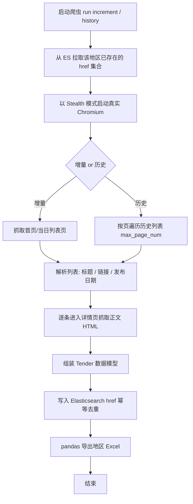
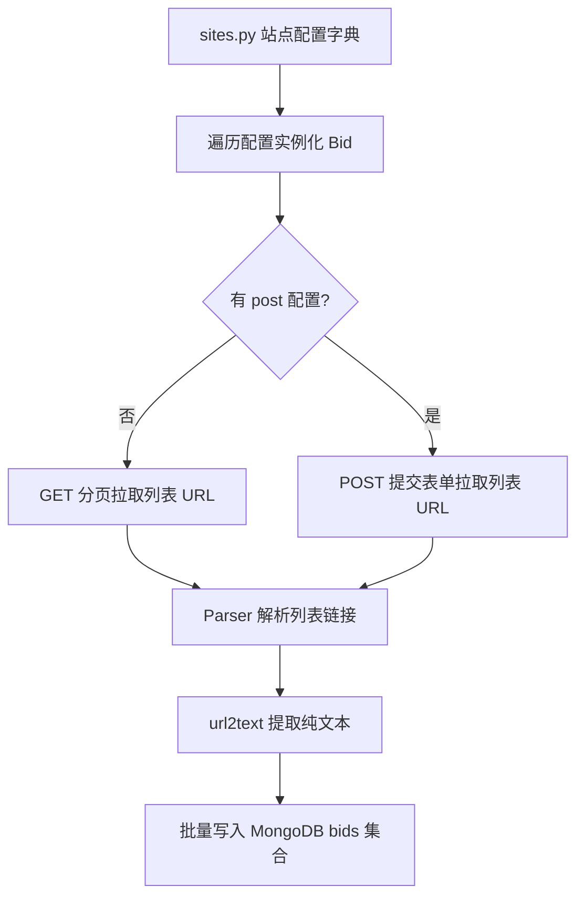

# bids-spider产品需求文档V1.0

| 文档版本 | 创建日期 | 修订简述 |
| ---- | ---- | ---- |
| V1.0 | 2026-09-17 | 初版：基于 GitHub 仓库 broholens/bids-spider 源码（`bids-spider/`）拆解，整理产品理解型 PRD |

## 目录

- [1 文档概述](#1-文档概述)
- [2 产品说明](#2-产品说明)
- [3 市场与竞品分析](#3-市场与竞品分析)
- [4 功能需求](#4-功能需求)
- [5 非功能需求](#5-非功能需求)
- [6 附录](#6-附录)

## 1 文档概述

### 1.1 背景概述

政府采购是我国公共资金支出的重要组成部分，各级政府采购网、公共资源交易平台依法公开招标公告、中标结果等信息。然而这些信息分散在全国数十个政府网站上，各站点的页面结构、编码、反爬策略差异极大，靠人工逐站浏览效率极低且容易漏标。

bids-spider（仓库内 README 中自述为 tender-spider）是一个**招标公告爬虫项目**，目标是自动抓取中国各省政府采购网 / 公共资源交易网的招标公告，将其清洗为结构化数据持久化，从而为"监控招标信息、及时获取商机"提供数据基础。项目作者是个人开发者 broholens，代码规模较小（约 16 个 Python 文件），目前处于"持续扩展支持省份"的演进状态。

本项目存在**两代技术实现**，同仓库共存：

- **旧版（配置驱动 + requests 链路）**：位于 `sites.py`、`spider.py`、`gov_parser.py`、`utils.py`、`ccgp.py`、`high_school_parser.py`。通过"站点配置字典 + 通用解析器"的模式接入任意网站，使用 `requests` + `lxml` + `selenium` 抓取，数据存入 `MongoDB` 与 `CSV`。
- **新版（Playwright 真实浏览器链路）**：位于 `crawler/` 目录（`base_crawler.py` 及北京 / 河北 / 辽宁 / 天津四个省份爬虫），辅以 `utils/es.py`、`utils/log.py`、`utils/captcha.py`。使用 `playwright` + `playwright-stealth` 驱动真实 Chromium 浏览器，数据存入 `Elasticsearch`（增量幂等去重），并支持 `pandas` 导出 Excel。

README 中列出了"目前支持"的北京、天津、河北三站，以及"待支持列表"中全国 30 余个省级站点，明确表达了项目向全国范围扩展的意图。

### 1.2 范围和边界

| 维度 | 范围说明 |
| ---- | ---- |
| 产品边界 | 面向招标公告的**采集、解析、结构化存储、导出**；不含投标、标书制作、招标发布等下游环节 |
| 业务边界 | 数据源为中国政府公开的采购与公共资源交易网站，属于合法公开数据抓取；不含需账号 / 付费权限的私有数据 |
| 技术边界 | Python 3；抓取层为 requests / selenium / playwright；存储层为 MongoDB（旧）与 Elasticsearch（新）；不含任务调度、代理池、分布式等生产级组件 |
| 当前支持站点 | 北京（ccgp-beijing）、天津（tjggzy）、河北（szj.hebei）已实现，辽宁（ccgp-liaoning）代码已具备，重庆（cqgp）为旧版配置，陕西（ccgp-shaanxi）为旧版专用脚本 |
| 扩展边界 | 其余省份为"待支持列表"，未实现，属后续规划 |

### 1.3 术语定义

| 术语 | 通俗解释 |
| ---- | ---- |
| 招标公告（Tender） | 采购方公开发布、邀请供应商参与投标的信息，含标题、发布时间、正文等 |
| 爬虫（Spider / Crawler） | 按规则自动访问网页并提取数据的程序 |
| 反爬策略 | 网站为防止程序批量抓取而设置的限制（如验证码、请求校验头、访问频率限制） |
| 增量抓取 | 只抓取新增/变化数据，跳过已抓过的内容 |
| 全量抓取（历史回补） | 从头抓取某个时间段范围内的全部历史数据 |
| 幂等 | 同一条数据重复写入不会产生重复记录 |
| 验证码（CAPTCHA） | 网站用于区分"真人"与"程序"的图形/文字校验 |
| OCR | 光学字符识别，把图片中的文字转成文本 |
| XPath | 一种在 HTML 中定位元素的查询语法 |
| Stealth 插件 | 隐藏浏览器自动化特征、降低被识别为爬虫概率的工具 |
| Elasticsearch（ES） | 一个开源搜索与分析引擎，本项目用作结构化数据存储 |
| Headless / 有头浏览器 | 无界面 / 有界面的浏览器运行模式 |

## 2 产品说明

### 2.1 产品简介

- **定位**：面向政府招标信息监控场景的开源爬虫工具，将分散在全国各省政府采购网的招标公告自动化采集、结构化入库，支持增量更新与历史回补，并可将结果导出为 Excel。
- **用户场景**：
  - 投标企业 / 市场人员：批量监控多省招标公告，及时掌握商机，避免漏标。
  - 数据从业者：获取政府采购公开数据的结构化语料，用于数据分析、招投标大数据研究。
  - 采购监督 / 研究机构：系统化采集政府采购公开信息用于监督与分析。
- **功能概览**：
  - 多站点招标公告采集（配置驱动，支持 GET / POST / JSON 接口 / 浏览器自动化多种抓取方式）。
  - 增量更新与历史全量回补双模式。
  - 结构化存储（Elasticsearch）与幂等去重、Excel 导出。
  - 反爬规避（随机延时、浏览器 Stealth、请求头拦截、UA 随机）与验证码 OCR 识别。
  - 关键词过滤与定制站点抓取（高校招聘信息等）。
  - 滚动日志与 ES 版本诊断。

### 2.2 产品流程

主流程（新版 Playwright 链路，以 `BaseCrawler.run()` 为准）：

旧版流程（配置驱动，`spider.py` → `gov_parser.Bid`）：

## 3 市场与竞品分析

> 本节外部数据均来自公开检索（千里马招标网官网、剑鱼标讯官网等），标注来源与口径，仅作量级参考；商业平台数据随平台运营实时变化，以官网为准。

### 3.1 市场规模

- 政府采购公开数据规模庞大：全国有**数百个**政府采购网站与公共资源交易平台，分散在不同行政区划与行业（来源：千里马招标网公开资讯）。
- 商业聚合平台的数据量可作为市场体量的参考：千里马招标网公开资料称其累计收录招投标数据超 **4 亿条**、覆盖约 **20 万个**信息渠道、日均更新商机约 **30 万条**（含招投标公告约 27 万条）；剑鱼标讯自称"每日更新 30 万条以上政府公开招标信息"。以上数据均来自各平台官网 / 公开资讯，口径为该平台自身收录量，非全市场总量。
- 中国政府采购网（ccgp.gov.cn）是法定的政府采购信息发布媒体，每日新增公告数千至上万条不等（公开资讯描述）。

### 3.2 目标用户画像

| 用户群 | 特征 | 核心诉求 |
| ---- | ---- | ---- |
| 中小投标企业 | 需跨省监控标讯、人手有限 | 低成本批量抓取、及时获知新增招标、按关键词筛选 |
| 数据 / 研究从业者 | 需要政府采购结构化语料 | 可扩展的采集框架、历史数据回补、结构化导出 |
| 采购监督机构 | 关注信息公开情况 | 系统化采集公开公告用于分析 |

### 3.3 竞品对比

| 维度 | bids-spider（本项目） | 开源采集项目（如 bid-collection） | 商业聚合平台（千里马 / 剑鱼 / 乙方宝） |
| ---- | ---- | ---- | ---- |
| 形态 | 开源 Python 爬虫脚本 | 开源 CLI / Agent Skill | SaaS / DaaS 收费平台 |
| 覆盖范围 | 已实现北京/天津/河北/辽宁/重庆/陕西，待支持列表覆盖 30+ 省 | 面向政府/央企/行业站点，可扩展 | 全国全覆盖，20 万级信息渠道 |
| 数据服务 | 原始采集入库（ES/MongoDB），需自行清洗分析 | 侧重商机筛选与报告 | 结构化标讯 + 推送 + 竞对分析 + AI 标书 |
| 更新方式 | 手动运行脚本，增量去重 | 可定时监控 | 实时推送（官方发布后约 10 分钟） |
| 成本 | 免费开源，需自建环境（浏览器/ES/OCR Key） | 开源免费 | 会员订阅（如剑鱼 ￥29/省/月起） |
| 适用人群 | 有开发能力的个人/团队 | 使用 Claude Code 的开发者 | 无开发能力的投标企业 |

### 3.4 差异化定位

- **优势**：开源免费、可完全自控（自建数据仓库，不依赖第三方平台与订阅费）；配置驱动的接入模式降低了新增站点的成本；同时提供增量 / 历史双模式与结构化导出，贴近"自建标讯库"诉求。
- **短板**：无任务调度、代理池、分布式能力，难以支撑大规模高频采集；无 UI、推送、订阅等面向业务用户的能力；站点适配依赖手工编写，站点改版后需维护；认证信息（ES 口令、OCR Key）硬编码在源码中，存在安全隐患。

## 4 功能需求

> 功能模块与实现细节文档的主题归纳保持一致（同一子系统视角），每个功能点按六要素描述。

### 4.1 站点接入与配置化框架

#### 4.1.1 站点配置驱动

- 功能简介：通过"站点配置字典"声明式描述一个网站的抓取方式，无需写代码即可接入新站点。
- 场景描述：新增某省采购网时，在 `sites.py` 增加一条配置即可被 `spider.py` 自动遍历执行。
- 前置条件：目标站点列表页与详情页结构已知；具备 requests 可访问性。
- 需求描述：配置项包括 `start_url`、`page_f`（分页模板）、`last_page_xp`（末页定位）、`xp_page`（是否 XPath 取末页）、`url_xp`（列表链接定位）、`url_prefix`（相对路径前缀）、`total_page`（固定页数）、`post_url`/`data`/`page_no_key`（POST 表单模式）、`divide_by`/`total_count_key`（JSON 接口总条数换算页数）、`decode`（页面编码）。
- 后置条件：`spider.py` 遍历配置，实例化 `Bid` 并执行抓取入库。
- 补充说明：`sites.py` 中保留大量被注释的历史配置，说明配置驱动模式曾被广泛使用；新版爬虫逐步取代该模式，改由按省份独立编写爬虫类。

#### 4.1.2 通用解析器

- 功能简介：`utils.Parser` 类封装"请求 → 解码 → 转树 → 提取链接/正文 → 入库"的通用能力。
- 场景描述：所有旧版站点共用同一套请求与解析逻辑，避免为每个站点重复实现。
- 前置条件：目标站点可被 requests 访问。
- 需求描述：提供 `get`/`post`（含随机 UA、5 秒超时）、`html2tree`（HTML 转 lxml 树）、`resp2x`（按配置编码解码，支持 JSON）、`url2tree`/`url2text`（正文提取，经 html2text 忽略链接与图片）、`get_total_page`（XPath / 正则 / JSON 三种方式计算总页数）、`get_bid_urls`（GET / POST 两种方式提取列表链接）、`save_text`（批量写入 MongoDB）。
- 后置条件：调用方获得结构化链接列表或已入库的正文数据。
- 补充说明：`get_bid_urls_with_json` 为未完成方法（存在 TODO），说明 JSON 结构动态字段的通用解析尚未实现。

### 4.2 Playwright 抓取引擎（新版核心）

#### 4.2.1 数据模型与基类

- 功能简介：`crawler/base_crawler.py` 定义统一数据模型 `Tender`（dataclass）与爬虫基类 `BaseCrawler`，提供运行骨架、存储与去重能力。
- 场景描述：所有新版省份爬虫继承 `BaseCrawler`，只实现"列表抓取 + 详情解析"两部分，其余复用。
- 前置条件：已安装 playwright 及 chromium、playwright-stealth、pandas、elasticsearch 依赖。
- 需求描述：`Tender` 字段为 `region`、`href`、`title`、`release_date`、`html`、`crawl_date`；基类提供 `run(increment=True)`（增量）与 `run(increment=False)`（历史回补）两种入口，统一完成"取已存在 URL → 启动 Stealth 浏览器 → 抓取 → 写 ES → 导 Excel"。
- 后置条件：产出结构化 Tender 集合，落入 ES 与 Excel。
- 补充说明：基类 `_crawl` / `_crawl_history` 为抽象钩子，由子类实现；`_random_sleep(1,60)` 随机延时内置于详情抓取循环。

#### 4.2.2 各省站点抓取

- 功能简介：按省份实现差异化的列表抓取与详情解析。
- 场景描述：北京、天津、河北、辽宁各站点页面结构不同，分别适配。
- 前置条件：对应站点可访问，站点结构未被改版破坏。
- 需求描述：
  - 北京：列表页 `li:has(a):has(span.datetime)` 定位，详情正文取 `.mainTextBox`，支持 140 页历史回补。
  - 河北：访问首页后跳转交易大厅，点击"政府采购"切换视图，用页面内 JS `evaluate` 抽取 `#content li` 的链接/标题/日期，详情取 `div.ewb-copy`。
  - 辽宁：监听页面请求拦截 `fn` 请求头，携带 Cookie 与自建 POST 体调用 `getHomePunInfoList` 接口拿列表。
  - 天津：监听请求拦截 `authorization`，读取字典接口获取"行业类型/信息类型"，逐类 POST `Announcement/Page` 拿公告 id，再 POST `Announcement/GetDetail` 拿详情，按 `exists_urls` 去重。
- 后置条件：各站 Tender 写入 ES 并导出 Excel。
- 补充说明：辽宁详情页正文抓取存在 TODO（`resp1.body()` 乱码，页面为 gb2312 编码），该环节未完成。

#### 4.2.3 增量与历史双模式

- 功能简介：通过 `increment` 参数控制只抓新增（增量）或从头抓全量（历史）。
- 场景描述：日常跑增量避免重复抓取；首次接入或数据缺失时跑历史回补。
- 前置条件：ES 中已存在该地区历史 `href` 数据（增量模式下用于去重）。
- 需求描述：`run(increment=True)` 走 `_crawl`（一般只抓首页 / 当日列表）；`run(increment=False)` 走 `_crawl_history`（北京按 `max_page_num=140` 逐页抓取）。
- 后置条件：增量模式下重复项被跳过；历史模式下完成区间回补。
- 补充说明：天津爬虫在循环内显式 `if tender_id in self.exists_urls: continue` 做增量去重。

### 4.3 数据存储与去重

#### 4.3.1 Elasticsearch 结构化存储

- 功能简介：`utils/es.py` 封装 ES 连接、索引管理与增删改查。
- 场景描述：新版爬虫将 Tender 持久化到本地 ES 集群。
- 前置条件：本地 ES 服务运行于 `http://127.0.0.1:9200`，凭据与索引名匹配。
- 需求描述：索引 `tenders` 定义字段 `region`（keyword）、`href`（keyword）、`title`（text+keyword）、`release_date`（keyword）、`crawl_date`（date）、`html`（text 且不索引）；提供 `ensure_index`（不存在即建）、`save_tender`/`save_tenders_bulk`（以 `href` 为文档 id 幂等写入，批量 chunk 500）、`search_data`/`update_data`/`delete_data`、`test_connection`（连通性诊断）、`check_es_version`（ES 8 兼容诊断）。
- 后置条件：招标数据可检索、可增量更新、可删除。
- 补充说明：ES 超级用户口令硬编码于源码（安全隐患，见 5.2）；`save_tenders_bulk` 对缺少 `href` 的记录跳过。

#### 4.3.2 MongoDB 旧版存储

- 功能简介：旧版链路将抓取的 URL 与纯文本批量写入 MongoDB。
- 场景描述：`spider.py` + `gov_parser.py` 时代的数据落库。
- 前置条件：本地 MongoDB 服务可用。
- 需求描述：`connect_col()` 连接 `bids` 库的 `bids` 集合，`save_text` 将 `{url, text}` 列表 `insert_many` 入库。
- 后置条件：招标 URL 与正文以 KV 形式入库。
- 补充说明：该存储方案无去重字段设计，重复抓取会积累重复记录。

#### 4.3.3 Excel 导出

- 功能简介：新版爬虫每轮抓取后将当前地区 Tender 导出为 Excel。
- 场景描述：无 ES 可视化场景下，用 Excel 直接交付 / 查看数据。
- 前置条件：依赖 `pandas`、`openpyxl`。
- 需求描述：`save_tenders_to_excel()` 将 `tenders.values()` 转为 DataFrame 并 `to_excel`，文件名形如 `beijing_2026_09_17_10_30_00.xlsx`。
- 后置条件：生成以地区 + 时间戳命名的 xlsx 文件。
- 补充说明：导出文件名由当前时间戳拼装，含 `_` 分隔，方便多轮结果并存。

### 4.4 反爬规避与验证码识别

#### 4.4.1 浏览器 Stealth 与随机延时

- 功能简介：降低被目标站点识别为爬虫的概率。
- 场景描述：所有新版爬虫访问目标站点时启用。
- 前置条件：安装 playwright-stealth；Chromium 可用。
- 需求描述：`BaseCrawler.run()` 内 `with Stealth().use_sync(sync_playwright())` 创建带反自动化标记的浏览器；启动参数含 `--disable-blink-features=AutomationControlled`；每个详情页抓取后 `_random_sleep(_max=30)`（1~60 秒随机）。
- 后置条件：访问特征更接近真人浏览器。
- 补充说明：浏览器以 `headless=False` 有头模式启动（与旧版 headless 相反，进一步降低识别概率，但占用窗口）。

#### 4.4.2 请求头拦截与认证提取

- 功能简介：从真实页面请求中动态捕获站点要求的动态请求头（如 `authorization`、`fn`）。
- 场景描述：天津、辽宁站点需携带动态请求头才能调用 JSON 接口。
- 前置条件：站点接口基于动态令牌校验。
- 需求描述：天津通过 `page.on("request")` 监听捕获 `authorization`，失败时降级从 `localStorage` 读取，随后拼入 `headers` 调用字典 / 列表 / 详情接口；辽宁同理捕获 `fn` 请求头并拼入自建请求。
- 后置条件：后续接口调用携带合法动态头。
- 补充说明：该策略是本项目应对"纯接口站点"的关键手段，替代了人工登录 / 逆向签名。

#### 4.4.3 验证码 OCR 识别

- 功能简介：`utils/captcha.py` 提供验证码图片的文字识别能力。
- 场景描述：目标站点出现图形 / 数字验证码时自动识别。
- 前置条件：配置百度 OCR 凭据（`BAIDU_OCR_APP_ID/API_KEY/SECRET_KEY`）或云码 `token`；本地安装 `tesseract`、`opencv`、`pillow`。
- 需求描述：`BaiduOCR` 对验证码图片做灰度化 + 阈值二值化 + 中值滤波预处理后调用百度 `basicGeneral` OCR；`YunMaOCR` 调用云码平台接口识别（type `10110` 通用数英）；支持 `recognize_url`（下载远程验证码后识别）与缓存清理。
- 后置条件：返回识别文本 `OCRResult(words)`；识别后默认删除临时图片。
- 补充说明：OCR 为可选依赖能力，凭据缺失时构造器抛 `ValueError` 明确提示。

#### 4.4.4 随机 UA 与请求容错

- 功能简介：旧版链路随机 User-Agent 与请求失败兜底。
- 场景描述：旧版 requests 请求目标站点时。
- 前置条件：依赖 `fake-useragent`。
- 需求描述：`Parser.get/post` 自动向请求头注入随机 UA；请求 / 解析 / 解码任一环节异常时返回空值（`None`/`''`）而非抛错中断。
- 后置条件：单点失败不中断整轮抓取。
- 补充说明：容错策略偏向"静默跳过"，代价是失败无告警（见 5.3）。

### 4.5 内容解析与信息筛选

#### 4.5.1 列表与详情解析

- 功能简介：从列表页提取公告链接，从详情页提取正文。
- 场景描述：所有抓取链路的基础环节。
- 前置条件：站点列表 / 详情页结构已知。
- 需求描述：列表解析支持 XPath（旧版 `url_xp`、新版 Playwright locator）与页面内 JS（河北 `evaluate`）；相对链接按 `url_prefix` 补全（北京 `//` 前缀补 `http:`）；详情正文分别取 `.mainTextBox`（北京）、`div.ewb-copy`（河北）、接口 `responseData.noticeContent`（天津）。
- 后置条件：产出结构化的标题 / 链接 / 日期 / 正文。
- 补充说明：不同站点正文容器差异大，属典型的手工适配点。

#### 4.5.2 关键词过滤

- 功能简介：`ccgp.py` 对正文按多关键词组合过滤，命中则保存。
- 场景描述：仅关心特定主题（如高校招聘）时，从海量公告中筛出目标。
- 前置条件：已取得公告正文文本。
- 需求描述：`filter_tender` 用 `html2text` 提取正文，对关键词组（如 `'大学 招聘'`，词间空格表"且"关系）逐组判断是否全部命中；命中写入 `result.csv`，已检查链接写入 `checked.csv` 防重。
- 后置条件：目标主题公告被筛出并落盘。
- 补充说明：筛选是旧版 `ccgp.py` 的核心价值；新版爬虫未内置关键词过滤，为待补齐能力（推测）。

#### 4.5.3 定制站点抓取（高校招聘）

- 功能简介：`high_school_parser.py` 针对高校官网招聘信息做定制抓取。
- 场景描述：抓取清华后勤、西北政法大学资产处等高校站点的招聘公告。
- 前置条件：站点可访问；selenium 驱动可用。
- 需求描述：清华站用 selenium 在搜索框输入关键词"招聘"回车检索并收集详情链接；西北政法站用 `url2tree` 解析分页列表收集链接。
- 后置条件：收集到目标 URL 集合（`urls`/`urls_cleaned`）。
- 补充说明：该脚本仅收集链接，未实现正文抓取与入库，为半成品示例。

## 5 非功能需求

> 按本项目实际取舍与加权列出，未涉及的维度从略。

| 维度 | 优先级 | 现状与要求 |
| ---- | ---- | ---- |
| 可靠性 | 高 | 站点改版 / 单页失败不应中断整轮抓取：新版基类以 `try/finally` 保证最终落库与导出；旧版 `get/post` 失败返回空不抛错；辽宁列表接口异常时返回空列表并打日志 |
| 性能与容量 | 中 | 单机串行抓取，内置随机延时（1~60s）换取稳定性而非吞吐；ES 批量写入 chunk=500；查询去重上限 `size=10000` |
| 兼容性 | 中 | ES 客户端需 `<9.0.0`（与 ES 8.x 兼容），`check_es_version` 提供诊断；页面编码需按站点配置（GBK/UTF-8）解码 |
| 可维护性 | 中 | 省份爬虫按 `crawler/<省>.py` 独立文件组织，接入新省只需实现 `_crawl` 钩子；旧版配置驱动把站点差异收敛到 `sites.py` |
| 安全 | 低（需改进） | ES 超级用户口令、天津 `authorization` 等敏感信息硬编码于源码；建议改为环境变量 / 配置文件并纳入忽略清单 |
| 可观测性 | 低 | 依赖 loguru 滚动日志（周切、保留 10 份、zip 压缩）；ES 提供版本与连通性诊断日志；无指标 / 告警能力 |
| 可扩展性 | 低 | 无任务调度、代理池、分布式抓取；规模上量后需自行补齐 |

## 6 附录

### 6.1 参考资料

- 源码仓库：GitHub `broholens/bids-spider`（本地克隆路径 `/Users/xingan/Documents/software/aiengine/bids-spider`）。
- 源码关键文件：`README.md`、`sites.py`、`spider.py`、`gov_parser.py`、`utils.py`、`ccgp.py`、`high_school_parser.py`、`crawler/base_crawler.py`、`crawler/beijing.py`、`crawler/hebei.py`、`crawler/liaoning.py`、`crawler/tianjin.py`、`utils/es.py`、`utils/captcha.py`、`utils/log.py`、`requirements.txt`。
- 市场数据来源：千里马招标网公开资讯（qianlima.com）、剑鱼标讯官网（jianyu360.cn）、中国政府采购网（ccgp.gov.cn）公开说明。

### 6.2 数据时效性声明

- 本 PRD 基于 2026-09-17 时点的源码内容与公开检索资料整理。
- 商业平台（千里马、剑鱼等）的市场数据以其官网实时数据为准，本文仅作量级参考。
- 目标站点（各省采购网 / 交易平台）页面结构随时间可能改版，源码中各省爬虫的定位器与接口参数可能因此失效，需以最新源码与站点实际为准。
