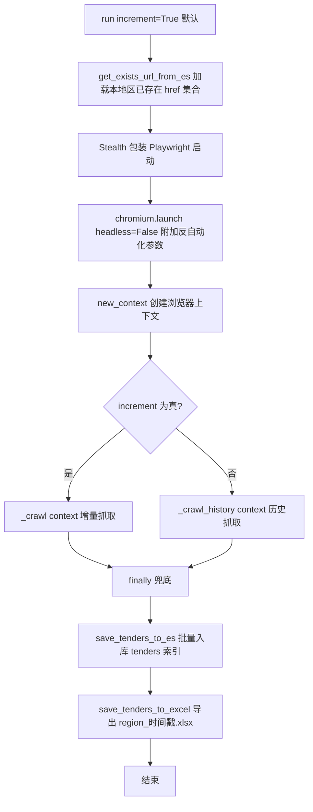
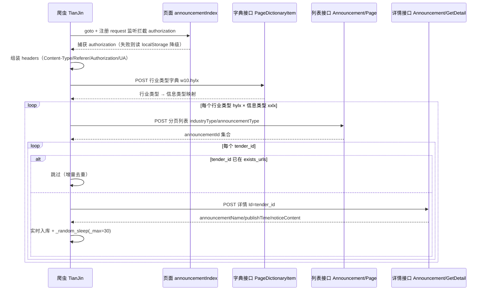

# bids-spider 实现细节-Playwright抓取引擎V1.0

| 文档版本 | 创建日期 | 修订简述 |
| --- | --- | --- |
| V1.0 | 2026-09-17 | 初版：梳理 BaseCrawler 运行骨架、Tender 数据模型、四省爬虫差异化实现、去重与延时机制 |

## 目录

- [1 子系统概述](#1-子系统概述)
- [2 核心机制详解](#2-核心机制详解)
  - [2.1 Tender 数据模型](#21-tender-数据模型)
  - [2.2 运行骨架：run(increment) 与浏览器启动](#22-运行骨架runincrement-与浏览器启动)
  - [2.3 增量与历史双模式](#23-增量与历史双模式)
  - [2.4 去重机制](#24-去重机制)
  - [2.5 详情页执行与随机延时](#25-详情页执行与随机延时)
  - [2.6 落库与导出](#26-落库与导出)
- [3 关键流程（Mermaid）](#3-关键流程mermaid)
  - [3.1 基类运行骨架流程图](#31-基类运行骨架流程图)
  - [3.2 各省抓取策略对比](#32-各省抓取策略对比)
  - [3.3 天津四步请求时序图](#33-天津四步请求时序图)
- [4 设计决策与权衡](#4-设计决策与权衡)
- [5 关键配置项](#5-关键配置项)
- [6 与其他子系统的关系](#6-与其他子系统的关系)
  - [6.1 与 utils/es.py 存储的关系](#61-与-utilsespy-存储的关系)
  - [6.2 与 utils/log.py 日志的关系](#62-与-utilslogpy-日志的关系)
  - [6.3 与反爬与验证码模块的关系](#63-与反爬与验证码模块的关系)
  - [6.4 与旧版配置驱动链路的关系](#64-与旧版配置驱动链路的关系)
  - [6.5 与 PRD 模块的对应关系](#65-与-prd-模块的对应关系)
- [7 源码定位](#7-源码定位)
- [8 参考资料](#8-参考资料)

## 1 子系统概述

bids-spider 的"Playwright 抓取引擎"是面向招标公告抓取场景的新一代采集链路，代码位于 `crawler/` 目录，由基类与四个省级爬虫组成：

- `BaseCrawler`（`crawler/base_crawler.py`）：提供统一的运行骨架——浏览器启动、增量/历史双模式入口、详情页执行、随机延时、ES 落库与 Excel 导出；
- `BeiJing`（`crawler/beijing.py`）：列表页 DOM 定位器解析；
- `HeBei`（`crawler/hebei.py`）：页面内 JavaScript 抽取列表；
- `LiaoNing`（`crawler/liaoning.py`）与 `TianJin`（`crawler/tianjin.py`）：请求头拦截 + JSON 接口直连。

该引擎的典型特征如下：

| 特征 | 说明 |
| --- | --- |
| 真实浏览器 | 使用 `playwright` 同步 API + `playwright-stealth`，以 `headless=False` 启动 Chromium 并附加反自动化检测参数 |
| 双模式入口 | `run(increment)` 统一分发：`increment=True` 走增量抓取 `_crawl`，`False` 走历史抓取 `_crawl_history` |
| 差异化抓取策略 | 同一基类下，各省按站点形态选择 DOM 定位器、页面内 JS 抽取或请求拦截 + JSON 接口三种取数方式 |
| 幂等去重 | 以 ES 中该地区已存在文档的 `_id`（即 href）集合为判重依据，增量跳过已入库条目 |
| 落库兜底 | `try/finally` 保证无论抓取过程是否异常，批量入库与 Excel 导出都会执行 |
| 反爬节流 | 每条详情抓取后执行均匀分布的随机延时，默认区间 `(1, 60)` 秒 |

引擎的顶层数据流为：列表页/接口取标题与链接 → 逐条进详情页取正文 HTML → 组装为 `Tender` 记录 → 写入 Elasticsearch（索引 `tenders`）并导出为本地 `xlsx`。

## 2 核心机制详解

### 2.1 Tender 数据模型

`Tender` 是引擎内部统一的招标记录结构，定义于 `crawler/base_crawler.py`，为 `@dataclass` 类，共六个字段：

| 字段 | 类型 | 默认值 | 语义 |
| --- | --- | --- | --- |
| `region` | `str` | 无（必填） | 地区标识，构造爬虫时传入，如 `beijing`、`hebei`、`liaoning`、`tianjin`；同时作为 ES 查询与索引分区键 |
| `href` | `str` | 无（必填） | 公告唯一标识。北京/河北为详情页 URL；辽宁为接口返回的 `infoPath`（可拼接绝对地址）；天津为接口返回的 `announcementId` |
| `title` | `str` | 无（必填） | 公告标题 |
| `release_date` | `str` | `''` | 发布日期文本（未统一格式化，随站点原始形态存储） |
| `html` | `str` | `''` | 详情页正文 HTML，作为检索用正文内容 |
| `crawl_date` | `str` | `''` | 抓取时间，由 `_get_crawl_date()` 生成，格式 `%Y-%m-%d %H:%M:%S` |

`href` 在整个链路中承担三重职责：列表去重的键（各省以 `href` 为 `tenders` 字典键）、ES 文档 `_id`（见 2.4）、详情页跳转目标。因此要求 `href` 在站内语义上唯一。

### 2.2 运行骨架：run(increment) 与浏览器启动

`BaseCrawler.run(increment=True)` 是引擎的统一入口，执行顺序如下：

1. 调用 `get_exists_url_from_es()` 从 ES 拉取本地区已存在的 href 集合，存入 `self.exists_urls`；
2. 进入 `try` 块：以 `Stealth().use_sync(sync_playwright()) as p` 启动 Playwright，创建真实 Chromium 浏览器实例与 `browser.new_context()` 上下文；
3. 按 `increment` 参数分发：`True` 调用 `self._crawl(context)`，`False` 调用 `self._crawl_history(context)`；
4. 进入 `finally` 块：无论抓取是否成功，依次执行 `save_tenders_to_es()`（批量入库）与 `save_tenders_to_excel()`（导出 xlsx）。

浏览器启动参数固定为：

| 参数 | 作用 |
| --- | --- |
| `headless=False` | 有头模式，真实可见窗口，便于观察与规避无头特征 |
| `--no-sandbox` / `--disable-setuid-sandbox` | 关闭 Chromium 沙箱，适配容器/root 运行环境 |
| `--disable-blink-features=AutomationControlled` | 关闭 `navigator.webdriver` 等自动化标记 |
| `--start-maximized` | 窗口最大化启动 |

`Stealth` 包装在 Playwright 之上，用于抹平自动化指纹。`_crawl` 与 `_crawl_history` 在基类中仅占位（`...`），由各省子类实现。

### 2.3 增量与历史双模式

`run(increment)` 的语义：`increment=True`（默认）执行单次增量抓取，仅拉取当前最新页面/最新列表；`increment=False` 执行历史回溯，遍历历史页直至 `max_page_num`。基类不实现具体逻辑，仅负责分发。

各省对两个钩子的实现情况：

| 省份 | `_crawl`（增量） | `_crawl_history`（历史） |
| --- | --- | --- |
| 北京 | 仅抓取第 1 页 | 遍历第 1 页至 `max_page_num=140` 页 |
| 河北 | 抓取交易大厅当前"政府采购"列表 | 未实现（基类占位） |
| 辽宁 | 按硬编码日期拉取接口列表 | 未实现（基类占位） |
| 天津 | 按行业/信息类型字典遍历列表 | 未实现（基类占位） |

即当前仅北京完整实现双模式；河北、辽宁、天津只实现增量钩子，历史模式下会因基类占位而空跑（推测：历史回溯能力尚在规划中）。

### 2.4 去重机制

去重的真相源是 Elasticsearch 中"本地区已入库文档的 href 集合"：

- `get_exists_url_from_es()` 构造查询：`term` 精确匹配 `region=self.region`，按 `release_date` 降序排序，`_source: false`，`size: 10000`；
- 返回 `set(i['_id'] for i in data)`。

关键前提：`utils/es.py` 中 `save_tender` 与 `save_tenders_bulk` 均以 `doc.get("href")` 作为文档 `_id` 写入，因此查询结果的 `_id` 集合即"该地区已存在的 href 集合"。代码注释写为"只返回 href 字段"，实际实现为 `_source: false` 后取 `_id`，注释与实现存在出入（源码事实）。

去重在不同省份的落点不同：

| 省份 | 去重落点 | 实现 |
| --- | --- | --- |
| 天津 | 列表层 | 遍历 `tender_id` 时 `if tender_id in self.exists_urls: continue` 直接跳过 |
| 北京/河北/辽宁 | 未使用 `exists_urls` | 依赖 ES 以 href 为 `_id` 的覆盖写实现幂等（重复入库自然覆盖，不产生重复文档） |

注：`size: 10000` 为单次查询返回上限，超过该量的历史数据不在判重范围内（推测：数据量增大后需调整该值）。

### 2.5 详情页执行与随机延时

`_execute_by_new_page(context, url, func, *args, **kwargs)` 是详情页抓取的统一执行器：

- 每个目标 URL 通过 `with context.new_page() as page` 新开独立页面，`goto(url, wait_until="domcontentloaded")` 等待 DOM 就绪后调用传入的 `func(page, ...)`；
- `with` 语句保证页面在函数返回后自动关闭，页面间状态互不污染（河北在 `_crawl` 内自行创建单页并复用，未走该执行器，源码事实）。

`_random_sleep(_min=1, _max=60)` 为静态方法，用 `random.uniform(_min, _max)` 生成均匀分布秒数并 `time.sleep`。北京、河北、天津在每条详情抓取后均调用 `_random_sleep(_max=30)`，即实际延时区间 `(1, 30)` 秒；辽宁未调用延时（源码事实）。

### 2.6 落库与导出

基类提供三个落库/导出方法，由 `finally` 块或各省在流程中直接调用：

| 方法 | 行为 |
| --- | --- |
| `save_tender_to_es(tender)` | 单条入库，调 `es_conn.save_tender`（href 作 `_id`）；河北、天津在抓取过程中实时调用 |
| `save_tenders_to_es()` | 批量入库，调 `es_conn.save_tenders_bulk(self.tenders.values())`；空集合时仅记日志不执行 |
| `save_tenders_to_excel()` | 将 `self.tenders` 经 `dataclasses.asdict` 转为字典列表，用 pandas 写入 `{region}_{时间戳}.xlsx`（时间戳为 `datetime.now()` 全量替换符号而来，含微秒），空集合时仅记日志 |

两种落库模式的差异（源码事实）：北京把全部记录累积在 `self.tenders`，由 `finally` 批量落库；河北、天津在详情抓取完成时即单条实时入库（河北不写入 `self.tenders`，故其 `finally` 中的批量落库为空操作），辽宁因详情正文未解决（见 3.2）未完成入库。

## 3 关键流程（Mermaid）

### 3.1 基类运行骨架流程图

### 3.2 各省抓取策略对比

| 维度 | 北京 | 河北 | 辽宁 | 天津 |
| --- | --- | --- | --- | --- |
| 取数形态 | DOM 定位器 | 页面内 JS 抽取 | 请求拦截 + JSON 接口 | 请求拦截 + JSON 接口 |
| 列表来源 | `li:has(a):has(span.datetime)` 定位器 | `page.evaluate` 执行 JS 抽取 `#content li` | `getHomePunInfoList` POST 接口 | `Dictionary/PageDictionaryItem` + `Announcement/Page` 接口 |
| 关键前置 | 无 | 首页跳转 → 交易大厅 → 点击"政府采购" | 拦截 `fn` 请求头、拼装响应头/cookie | 拦截 `authorization`，失败降级 `localStorage` |
| href 处理 | `//` 前缀补 `http:` | 直接使用 `a.href` | 非 `http` 前缀拼 `http://218.60.151.59:9004/` | 使用 `announcementId` |
| 详情正文 | `.mainTextBox` 的 `inner_html` | `div.ewb-copy` 的 `inner_html` | 未完成（乱码 TODO） | `noticeContent` 字段 |
| 落库方式 | `finally` 批量 | 逐条实时 | 未完成 | 逐条实时 + 写入 `tenders` |
| 延时 | `_random_sleep(_max=30)` | `_random_sleep(_max=30)` | 无 | `_random_sleep(_max=30)` |
| 增量去重 | 依赖 ES `_id` 覆盖写 | 依赖 ES `_id` 覆盖写 | 依赖 ES `_id` 覆盖写 | 列表层 `exists_urls` 跳过 |

各省抓取要点：

- **北京**：`_crawl` 仅抓第 1 页（`A002004001index_1.htm`）；`_crawl_history` 遍历 `index_{1..140}.htm`。每条记录通过 `_execute_by_new_page` 新开页面解析详情，`href` 以 `//` 开头时补全 `http:` 前缀（相对协议地址）。
- **河北**：先 `goto` 站点首页（超时 60s）再跳转交易大厅（超时 5s），等待 `ul#content` 出现后点击 `a:text-is("政府采购")`，最后通过 `page.evaluate` 注入 JS 直接读取 `#content li` 下 `a.href`/`a.title` 与 `span.r` 的文本，返回 JS 数组 `[{href, title, releaseDate}]`；每条详情等待 `div.ewb-copy`（超时 10s）取正文并实时入库。
- **辽宁**：注册 `page.on("request")` 监听，从页面请求头中截取 `fn` 值；`goto` 后把响应头并入 `headers`，再手动补充 `content-type: application/json;charset=UTF-8`、`access-control-allow-origin: */*`、`isloading: true`；`_parse_cookie` 遍历 `context.cookies()` 逐条赋值 `cookie` 头（循环覆盖，最终保留最后一个 cookie，源码事实）；随后用 `context.request.post` 直连 `getHomePunInfoList` 接口（`infoTypeCode: "1001"` 即采购公告，`rowCount: 100`），日期参数为硬编码 `today = '2025-12-01'`（原动态日期 `datetime.today().date()` 已被注释）。详情页仅 `goto` 后 `print(1)`，正文因 `charset=gb2312` 乱码未解决（源码 TODO：`resp1.body()乱码`）。
- **天津**：四步链路见 3.3，`href` 即 `announcementId`，详情通过 `GetDetail` 接口返回 `announcementName`/`publishTime`/`noticeContent`。

### 3.3 天津四步请求时序图

## 4 设计决策与权衡

| 决策 | 取舍分析 |
| --- | --- |
| 真实浏览器 + Stealth，而非纯 HTTP 直连 | 换取更高反爬通过率：`headless=False` 与 `--disable-blink-features=AutomationControlled` 抹平自动化指纹；代价是资源占用高、不适合大规模并发 |
| `run(increment)` 双模式参数化 | 增量抓取面向日常更新，历史抓取面向首次回补；由同一入口分发，子类只需实现对应钩子 |
| 三种取数策略并存 | DOM 定位器（北京）适用于结构稳定页面；页面内 JS 抽取（河北）规避框架渲染延迟，一次取整页列表；请求拦截 + JSON 接口直连（辽宁/天津）跳过页面渲染，直取结构化数据，但依赖请求头拼装正确 |
| 以 ES href 作文档 `_id` | 判重集合退化为 `_id` 集合查询（`_source: false` + `size: 10000`），重复抓取天然覆盖写，幂等；代价是 `_id` 必须全局唯一，天津用 `announcementId`、辽宁用拼接后的 URL，两者语义不同但均唯一 |
| 每个详情页新开 `page` | `with context.new_page()` 保证页面用完即关、状态隔离；代价是页面创建开销大，配合 `_random_sleep` 进一步放慢节奏 |
| `_random_sleep(1, 60)` 均匀分布随机延时 | 模拟人工访问节奏规避频控；各省实际以 `_max=30` 调用，即 `(1, 30)` 秒 |
| `try/finally` 兜底落库 | 即使单页抓取抛异常，已累积的 `tenders` 仍会在 `finally` 中批量入库并导出，避免整轮数据丢失 |
| 河北/天津实时单条入库 | 每条详情完成后立即写 ES，异常时损失窗口小；但放弃了批量写入的性能优势（对比北京 `finally` 批量 + `chunk_size=500`） |
| 辽宁硬编码日期 `'2025-12-01'` | 动态日期已被注释替换，当前固定查询 2025-12-01 当天数据，属调试残留（推测），需恢复动态日期方可长期运行 |
| 辽宁详情正文乱码未处理 | 站点返回 `charset=gb2312` 编码，当前仅 `goto` 不解析（TODO），辽宁链路处于"列表可取、详情缺失"的半成品状态（源码事实） |

## 5 关键配置项

| 配置项 | 位置 | 默认值 | 说明 |
| --- | --- | --- | --- |
| `headless` | `base_crawler.py` `run()` | `False` | 有头模式启动 Chromium |
| `--disable-blink-features=AutomationControlled` | `base_crawler.py` 启动参数 | 固定 | 关闭自动化检测标记 |
| `--no-sandbox` / `--disable-setuid-sandbox` | `base_crawler.py` 启动参数 | 固定 | 关闭沙箱，适配容器环境 |
| `--start-maximized` | `base_crawler.py` 启动参数 | 固定 | 窗口最大化 |
| `max_page_num` | `beijing.py` `__init__` | `140` | 北京历史模式最大页码 |
| `_random_sleep` 延时区间 | `base_crawler.py` | `(1, 60)` 秒 | `random.uniform` 均匀分布 |
| 各省详情间延时 | `beijing/hebei/tianjin.py` | `_max=30` | 实际区间 `(1, 30)` 秒 |
| `chunk_size` | `utils/es.py` `save_tenders_bulk` | `500` | 批量入库每批条数 |
| 去重查询 `size` | `base_crawler.py` | `10000` | 单 region 判重集合返回上限 |
| `wait_until` | `base_crawler.py` | `domcontentloaded` | 详情页就绪条件 |
| 河北首页/交易大厅超时 | `hebei.py` | `60000` / `5000` ms | 首跳与二跳超时 |
| 河北 `ul#content` / `div.ewb-copy` 等待 | `hebei.py` | `30000` / `10000` ms | 列表与详情选择器等待 |
| 天津列表分页参数 | `tianjin.py` | `PageSize=50`、`State=2` | 列表接口分页与状态过滤 |
| 辽宁列表参数 | `liaoning.py` | `rowCount=100`、`infoTypeCode="1001"` | 每页条数与"采购公告"类型 |
| ES 连接 | `utils/es.py` | `http://127.0.0.1:9200`，索引 `tenders` | 本地 ES 实例（源码内含 basic_auth 凭证，未在本文档展开） |

## 6 与其他子系统的关系

### 6.1 与 utils/es.py 存储的关系

`utils/es.py` 提供 `ESConnection` 封装，是引擎的持久化底座：

- 索引 `tenders` 的 mapping 与 `Tender` 六字段一一对应：`region`/`href`/`release_date` 为 `keyword`，`title` 为 `text`（附带 `keyword` 子字段，`ignore_above: 256`），`crawl_date` 为 `date`（格式 `yyyy-MM-dd HH:mm:ss` 等），`html` 为 `text` 且 `index: false`（只存不索引），`dynamic: false` 关闭动态映射；
- `save_tender` 与 `save_tenders_bulk` 以 `href` 为文档 `_id`，支撑 2.4 的 `_id` 集合判重；
- `search_data` 被 `get_exists_url_from_es` 调用，执行 region 精确匹配查询。

### 6.2 与 utils/log.py 日志的关系

`utils/log.py` 基于 loguru 配置全局日志：输出级别 `INFO`，落盘 `log` 文件，`rotation="1 weeks"`、`retention=10`、`compression="zip"`，`enqueue=True` 异步写入。引擎在关键节点打点：`[region]start to goto: {url}`（详情跳转）、`Found tender`（北京列表解析）、`get N items`（河北抽取）、`get data failed`（接口异常）、`Save N tenders to Elasticsearch`（批量入库）、`Nothing to save`（空集合）等。

### 6.3 与反爬与验证码模块的关系

`utils/captcha.py` 提供验证码识别能力：`BaiduOCR`（百度 AipOcr，含灰度/二值化/中值滤波预处理）与 `YunMaOCR`（jfbym 云码，按次计费）。该模块与 `baidu-aip`、`pillow`、`pytesseract`、`opencv-python` 等依赖配套，面向登录/验证码拦截场景；在本引擎四个爬虫源码中均未被引用（源码事实），当前 Playwright 引擎主要依赖 Stealth + 真实浏览器规避反爬，而非显式打码。

### 6.4 与旧版配置驱动链路的关系

旧版链路位于项目根目录：`spider.py` 遍历 `sites.py` 中的站点配置字典，实例化 `gov_parser.py` 的 `Bid` 类，由 `utils.py` 的 `Parser` 基于 requests + XPath 模板拉取列表并落 CSV。其核心是"配置驱动"：站点差异（起始页、页码模板、XPath、POST 参数）全部收敛于配置字典。

新旧两代链路的差异：

| 维度 | 旧版配置驱动链路 | Playwright 抓取引擎 |
| --- | --- | --- |
| 请求载体 | requests + XPath | Playwright 真实浏览器 / `context.request` |
| 站点适配 | 配置字典声明式 | 各省子类代码式（`_crawl` 覆写） |
| 存储 | CSV 文件 | Elasticsearch（`tenders` 索引）+ xlsx 导出 |
| 去重 | CSV 集合差集（`ccgp.py`） | ES `_id` 集合 |
| 数据模型 | `Bid` + 解析器 | `Tender` dataclass |

两者并存于仓库：`crawler/` 为新一代实现，旧版 `spider.py`/`sites.py`/`gov_parser.py`/`ccgp.py` 仍保留（README 中"目前支持"仍指向旧版站点清单，源码事实）。

### 6.5 与 PRD 模块的对应关系

产品需求文档（`docs/outcome/bids-spider产品需求文档V1.0.md`）中"Playwright 抓取引擎"模块对应本引擎全部能力：`crawler/base_crawler.py` 为引擎骨架，`crawler/` 下四个省份文件为站点适配实现，`utils/es.py` 与 `utils/log.py` 为配套存储与日志子系统。依赖声明见 `requirements.txt`（`playwright`、`playwright-stealth`、`pandas`、`loguru`、`openpyxl`、`elasticsearch<9.0.0` 等）。

## 7 源码定位

| 文件 | 关键类/方法 | 职责 |
| --- | --- | --- |
| `crawler/base_crawler.py` | `Tender`（dataclass） | 六字段招标记录模型 |
| `crawler/base_crawler.py` | `BaseCrawler.run(increment)` | 运行骨架：启动浏览器、双模式分发、`finally` 落库导出 |
| `crawler/base_crawler.py` | `BaseCrawler._crawl` / `_crawl_history` | 增量/历史钩子（基类占位，子类覆写） |
| `crawler/base_crawler.py` | `BaseCrawler._execute_by_new_page` | 每详情页新开 `page` 执行函数 |
| `crawler/base_crawler.py` | `BaseCrawler._random_sleep(_min=1, _max=60)` | 均匀分布随机延时 |
| `crawler/base_crawler.py` | `BaseCrawler.save_tenders_to_es` / `save_tenders_to_excel` | 批量入库与 xlsx 导出 |
| `crawler/base_crawler.py` | `BaseCrawler.get_exists_url_from_es` | 拉取本地区已存在 href 集合（`_id` 集合） |
| `crawler/beijing.py` | `BeiJing.get_one_page_titles` / `parse_detail` | 列表定位器解析与 `.mainTextBox` 详情 |
| `crawler/hebei.py` | `HeBei._crawl` | 首页跳转 + `page.evaluate` 抽取 `#content li` + `div.ewb-copy` 详情 |
| `crawler/liaoning.py` | `LiaoNing._parse_cookie` / `_get_tenders_list` | cookie 拼装与 `getHomePunInfoList` 接口直连 |
| `crawler/tianjin.py` | `TianJin._get_page_dictionary` / `_get_tender_list` / `_get_tender_details` | 授权 → 字典 → 列表 → 详情四步链路 |
| `utils/es.py` | `ESConnection.save_tender` / `save_tenders_bulk` / `search_data` | 以 href 为 `_id` 的存取与查询 |
| `utils/log.py` | 全局 `logger` | loguru 日志配置 |
| `utils/captcha.py` | `BaiduOCR` / `YunMaOCR` | 验证码 OCR（引擎未引用） |

## 8 参考资料

- 产品需求文档：`docs/outcome/bids-spider产品需求文档V1.0.md`（同目录）
- 依赖清单：`requirements.txt`
- 引擎源码：`crawler/base_crawler.py`、`crawler/beijing.py`、`crawler/hebei.py`、`crawler/liaoning.py`、`crawler/tianjin.py`
- 配套模块：`utils/es.py`、`utils/log.py`、`utils/captcha.py`
- 旧版链路参考：`spider.py`、`sites.py`、`gov_parser.py`、`ccgp.py`
- 第三方库：Playwright（同步 API）、playwright-stealth、pandas、loguru、elasticsearch（`<9.0.0`）
