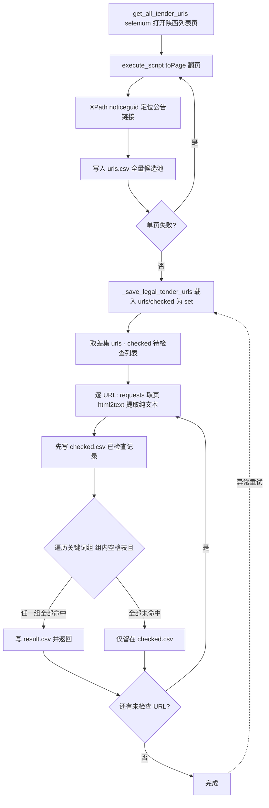
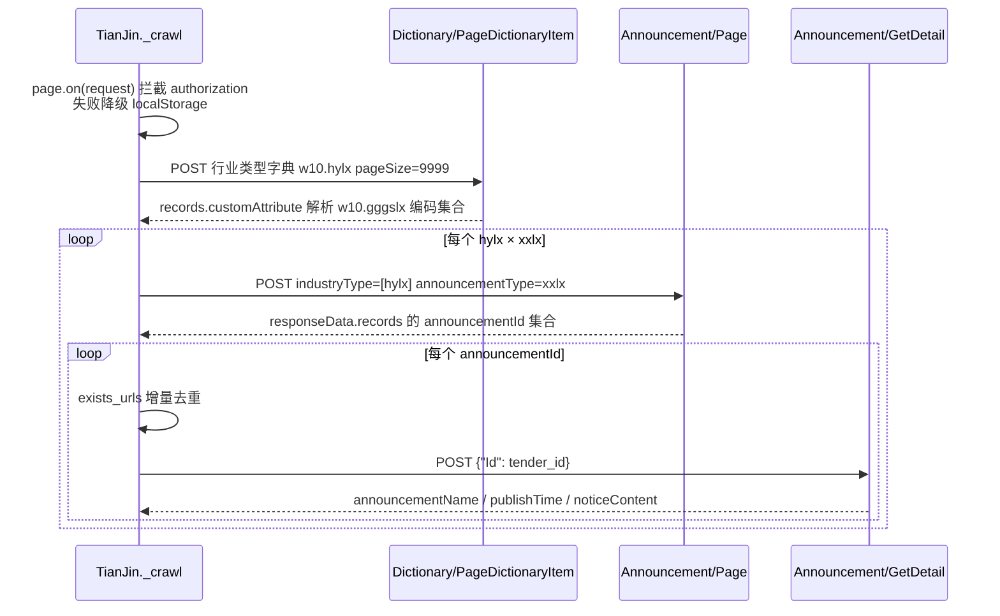

# bids-spider 实现细节-内容解析与信息筛选V1.0

| 文档版本 | 创建日期 | 修订简述 |
| --- | --- | --- |
| V1.0 | 2026-09-17 | 初版：梳理新版 Playwright 链路（北京 locator、河北页面内 JS、辽宁/天津 JSON 接口与字典联动）与旧版 requests/selenium 链路（Parser.url2text、ccgp.py 关键词过滤三 CSV、高校招聘定制）的列表/详情解析与信息筛选机制 |

## 目录

- [1 子系统概述](#1-子系统概述)
- [2 核心机制详解](#2-核心机制详解)
  - [2.1 新版链路列表解析](#21-新版链路列表解析)
  - [2.2 新版链路详情解析与正文容器](#22-新版链路详情解析与正文容器)
  - [2.3 相对链接补全](#23-相对链接补全)
  - [2.4 JSON 接口解析与字典联动](#24-json-接口解析与字典联动)
  - [2.5 旧版 Parser 通用解析](#25-旧版-parser-通用解析)
  - [2.6 关键词过滤与三 CSV 分工](#26-关键词过滤与三-csv-分工)
  - [2.7 高校招聘定制解析](#27-高校招聘定制解析)
  - [2.8 页面编码处理](#28-页面编码处理)
- [3 关键流程](#3-关键流程)
  - [3.1 新版解析链路流程](#31-新版解析链路流程)
  - [3.2 关键词过滤流程](#32-关键词过滤流程)
  - [3.3 天津字典联动流程](#33-天津字典联动流程)
- [4 设计决策与权衡](#4-设计决策与权衡)
- [5 关键配置项](#5-关键配置项)
- [6 与其他子系统的关系](#6-与其他子系统的关系)
- [7 源码定位](#7-源码定位)
- [8 参考资料](#8-参考资料)

## 1 子系统概述

内容解析与信息筛选是 bids-spider 的"从网页/接口中取出招标信息、并按需筛选"环节，位于抓取引擎之后、数据存储之前。职责分两部分：

- **内容解析**：从列表页/列表接口提取公告的标题、链接、发布日期，再进入详情页/详情接口提取公告正文，组装为结构化数据模型 `Tender`（`region`/`href`/`title`/`release_date`/`html`/`crawl_date` 六字段，定义于 `crawler/base_crawler.py`）。
- **信息筛选**：对解析得到的公告正文按关键词组合过滤，只保留命中的目标公告（旧版 `ccgp.py` 的核心价值）。

项目存在两代并存的技术链路，解析与筛选方式随之分化：

- **新版 Playwright 链路**（`crawler/beijing.py`、`crawler/hebei.py`、`crawler/liaoning.py`、`crawler/tianjin.py`）：列表解析有三种形态——北京用 Playwright locator（`li:has(a):has(span.datetime)`），河北用页面内 JS `evaluate` 抽取 DOM，辽宁/天津用 JSON 接口（`getHomePunInfoList`、`Announcement/Page`）解析响应记录。详情正文分别取自 `.mainTextBox`（北京）、`div.ewb-copy`（河北）、接口 `responseData.noticeContent`（天津）；辽宁详情正文解析存在未完成的 TODO（gb2312 乱码）。
- **旧版 requests/selenium 链路**（`utils.py`、`gov_parser.py`、`ccgp.py`、`high_school_parser.py`）：`Parser.url2tree`/`url2text` 提供通用"请求→解码→转树/提文本"能力，`gov_parser.Bid` 按配置字典提取列表链接；`ccgp.py` 针对陕西站点做 selenium 翻页 + 关键词过滤写入三份 CSV；`high_school_parser.py` 针对高校招聘站点做定制链接收集。

不同站点的定位器与正文容器差异大，属典型的手工适配点，不存在"一套解析器通吃所有站点"的设计。

## 2 核心机制详解

### 2.1 新版链路列表解析

各站点的列表解析方式如下表：

| 站点 | 列表来源 | 解析手段 | 提取字段 |
| --- | --- | --- | --- |
| 北京 | 列表页 HTML（`A002004001index_{n}.htm`） | Playwright locator `li:has(a):has(span.datetime)` | `<a>` 的 `href`、`inner_text`（标题），`span.datetime` 的 `inner_text`（日期） |
| 河北 | 交易大厅页面 DOM | 页面内 JS `evaluate`：`document.querySelectorAll('#content li')` | `<a>` 的 `href`、`title`，`span.r` 的 `textContent.trim()`（日期） |
| 辽宁 | POST 接口 `getHomePunInfoList` | `context.request.post` + `response.json()` | `title`、`releaseDate`、`infoPath` |
| 天津 | POST 接口 `Announcement/Page` | `context.request.post` + `response.json()` | `announcementId` 集合 |

**北京（`get_one_page_titles`）**：`page.locator("li:has(a):has(span.datetime)").all()` 用 CSS `:has()` 组合选择器筛选"同时含链接与日期 span"的列表项；对每个 `<li>` 再取 `a` 标签的 `href` 与文本、`span.datetime` 的日期文本，直接构造 `Tender`。列表为空时打 `logger.warning("No details found.")` 并返回空字典。增量模式 `_crawl` 只抓第 1 页，历史回补 `_crawl_history` 循环 1 至 `max_page_num=140`。

**河北（`_crawl`）**：先访问首页 `https://szj.hebei.gov.cn/`，再跳转交易大厅页，`wait_for_selector("ul#content")` 等待列表容器，点击 `a:text-is("政府采购")` 切换视图，随后用 `page.evaluate` 注入页面内 JS 直接遍历 `#content li`：`link.href`、`link.title`（标题）、`span.r.textContent.trim()`（发布日期），过滤掉三项全空的条目后返回数组。此方式绕过定位器逐元素解析，一次 evaluate 批量取回列表数据。

**辽宁（`_get_tenders_list`）**：通过 `context.request.post` 调用列表接口，请求体（JSON）参数如下：

| 参数 | 取值 | 说明 |
| --- | --- | --- |
| `title` | `""` | 标题模糊检索，空为不过滤 |
| `planNo` | `""` | 计划编号 |
| `district` | `"[]"` | 地区筛选，空数组字符串 |
| `releaseDateStart` / `releaseDateEnd` | 传入日期字符串 | 公告发布日期区间（同日） |
| `infoTypeCode` | `"1001"` | 信息类型，注释标注"采购公告" |
| `current` | `1` | 页码 |
| `rowCount` | `100` | 每页条数 |

接口返回 JSON，成功判断为 `data.get("code") == 200`；`data["data"]["total"] == 0` 时视为当日无公告，返回空列表；每条记录取 `title`、`releaseDate`、`infoPath` 三项。注意源码中调用时日期为硬编码 `today = '2025-12-01'`（`datetime.today()` 被注释），即当前未按运行当日动态取数。

**天津（`_get_tender_list`）**：POST `Announcement/Page` 接口，请求体含 `PageIndex=1`、`PageSize=50`、`State=2`、`industryType=[hylx]`、`announcementType=xxlx`、`publishTimeType=-1` 等参数；成功判断为 `data.get("statusCode") == 2000`，成功后将 `responseData.records` 中每条 `announcementId` 收进 `set` 返回（天然去重）。该接口依赖"行业类型 × 信息类型"组合遍历调用，见 2.4 字典联动。

### 2.2 新版链路详情解析与正文容器

各站点详情正文的容器/字段差异是手工适配的核心点：

| 站点 | 详情来源 | 正文提取方式 | 正文形态 |
| --- | --- | --- | --- |
| 北京 | 详情页 HTML | `page.locator(".mainTextBox").inner_html()`（静态方法 `parse_detail`） | 正文容器原始 HTML |
| 河北 | 详情页 HTML | `page.wait_for_selector("div.ewb-copy")` 后 `page.locator("div.ewb-copy").inner_html()` | 正文容器原始 HTML |
| 天津 | POST 接口 `Announcement/GetDetail` | `data["responseData"]["noticeContent"]` | 接口返回的正文 HTML 字段 |
| 辽宁 | 详情页 HTML | 未完成：`resp1.body()` 读取响应后注释标注"乱码 charset=gb2312" | 无（TODO） |

**北京（`_crawl_one_page`）**：列表解析完成后，对每条记录经 `_execute_by_new_page`（基类方法：新开页面 → `page.goto(url, wait_until="domcontentloaded")` → 执行回调）抓详情，将 `parse_detail` 返回值赋给 `tender.html`，再补 `crawl_date = _get_crawl_date()`，存入 `self.tenders[url]`，每次详情抓取后 `_random_sleep(_max=30)`。

**河北**：对每个列表项 `page.goto(result['href'])` 后先 `wait_for_selector("div.ewb-copy", timeout=10000)` 等正文容器渲染，再取 `inner_html()`，连同列表阶段取得的 `href`/`title`/`releaseDate` 一次组装 `Tender` 并 `save_tender_to_es` 实时单条入库（不写入 `self.tenders`，因此该站不触发 Excel 导出）。

**天津（`_get_tender_details`）**：POST `Announcement/GetDetail`，请求体 `{"Id": tender_id}`；成功判断 `statusCode == 2000`；从 `responseData` 取 `announcementName`（标题）、`publishTime`（发布日期）、`noticeContent`（正文 HTML）组装 `Tender`，`href` 字段即 `announcementId`，随后 `save_tender_to_es` 并写入 `self.tenders`。

**辽宁**：详情环节仅执行 `page.goto(record[1])` 并取 `resp1.body()`，源码以 TODO 标注该响应体乱码（站点页面为 gb2312 编码），正文解析与落库未实现。

### 2.3 相对链接补全

列表阶段拿到的链接可能是相对路径或协议相对地址，各站点补全方式不同：

| 站点 | 原始形态 | 补全规则 | 代码依据 |
| --- | --- | --- | --- |
| 北京 | `//xxx/yyy.htm`（协议相对 URL） | `href.startswith("//")` 时补 `http:` 前缀 | `href_full = f"http:{href}" if href.startswith("//") else href` |
| 辽宁 | `infoPath` 为相对路径（不以 `http` 开头） | 拼接域名端口前缀 | `href = 'http://218.60.151.59:9004/' + href` |
| 河北 | DOM 属性 `link.href` | 无需补全：浏览器解析 DOM 后 `href` 属性天然为绝对地址 | evaluate 内直接取 `link.href` |
| 天津 | 接口直接给 `announcementId` | 无需补全：以 id 作为 `href` 调详情接口 | `Tender(href=tender_id, ...)` |
| 旧版（gov_parser） | `url_xp` 提取的 href | `url_prefix` 拼接；`prefix` 非空时先 `i.split('/', 1)[-1]` 去掉协议段再拼 | `get_bid_urls` 中 `i = i.split('/', 1)[-1]; urls.append(prefix+i)` |

两种典型补全范式：**协议相对地址补全**（北京，`//` → `http:`）与**域名前缀拼接**（辽宁、旧版 `url_prefix`）。补全后北京以完整 URL 作为 `Tender.href`（同时是 `tenders` 字典 key 与后续 ES 去重依据），保证 `href` 在站内语义唯一。

### 2.4 JSON 接口解析与字典联动

**成功判断统一模式**：两类接口站点均采用"响应码 + 数据层字段"两级判断：

| 站点 | 成功码 | 空数据判断 | 数据载体 |
| --- | --- | --- | --- |
| 辽宁 | `code == 200` | `data["data"]["total"] == 0` | `data["data"]["data"]`（records 数组） |
| 天津 | `statusCode == 2000` | 无显式空判断，空 records 即空集合 | `responseData.records`（数组） |

**天津字典联动**是接口站点解析的典型机制，分三层：

1. **字典接口**（`_get_page_dictionary`）：POST `Dictionary/PageDictionaryItem`，请求体 `{"state": 1, "pageIndex": 1, "pageSize": 9999, "dictionaryTypeCode": "w10.hylx"}` 拉取"行业类型"字典（政府采购/房屋市政等）。每条记录的 `customAttribute` 是 JSON 字符串，源码注释展示了其结构，例如"政府采购"对应：

```json
[{"typeCode": "w10.xxlx", "value": ["13","14","15","16","17","18","19"]},
 {"typeCode": "w10.gggslx", "value": ["3","10","16","22"]},
 {"typeCode": "w10.xzqh", "value": ["120100","120116",...]}]
```

解析逻辑：`json.loads(record['customAttribute'])` 遍历各对象，取 `typeCode == 'w10.gggslx'` 的 `value` 数组（即该行业下的**信息类型编码集合**，如评标结果公示/定标结果公示等），最终构造成 `{行业类型 itemValue: 信息类型编码列表}` 映射。源码中另有一份被注释的替代方案：直接以 `dictionaryTypeCode: "w10.gggslx"` 查询信息类型字典（`{itemValue: itemText}`）。

2. **列表接口**（`_get_tender_list`）：对映射中的每个 `hylx`（行业类型）与其下每个 `xxlx`（信息类型编码）组合调用 `Announcement/Page`，得到 `announcementId` 集合。

3. **详情接口**（`_get_tender_details`）：对每个 id 调用 `Announcement/GetDetail` 取详情。抓取循环中先 `if tender_id in self.exists_urls: continue` 做增量去重，再抓详情、随机睡眠（`_max=30`）。

**请求头前置**：天津/辽宁的接口调用依赖动态请求头——天津经 `page.on("request")` 拦截捕获 `authorization`（失败时降级 `localStorage.getItem('authorization')`），并拼 `Content-Type`/`Referer`/`User-Agent`（`navigator.userAgent`）构造 `headers`；辽宁拦截捕获 `fn` 请求头、Cookie 与响应头，再补 `content-type: application/json;charset=UTF-8` 等。该机制属于反爬侧的请求头拦截，但直接决定了接口解析能否成功（详见 2.1/2.4 及第 6 章）。

### 2.5 旧版 Parser 通用解析

`utils.Parser` 封装"请求 → 解码 → 转树/提文本 → 提取链接 → 入库"的通用能力，供旧版配置驱动链路（`gov_parser.Bid`）与高校定制脚本（`high_school_parser.py`）复用：

| 方法 | 行为 |
| --- | --- |
| `get` / `post` | requests 封装，自动注入随机 UA（`fake_useragent`），超时 `REQUEST_TIMEOUT=5`，异常静默返回 `None` |
| `html2tree` | `lxml.etree.HTML(html)`，异常返回 `None` |
| `resp2x(resp, json=False)` | `json=False` 时按 `self.decode` 解码 `resp.content`；`json=True` 时 `resp.json()`；异常返回 `''` |
| `url2tree` | `get` → `resp2x` → `html2tree`，返回 lxml 树供 XPath 提取 |
| `url2text` | `get` → `html2text.HTML2Text()`（`ignore_links=True`、`ignore_images=True`）→ 返回纯文本正文。`html2text` 忽略链接与图片，正文只剩可检索文本 |
| `get_total_page_with_json` | 从 JSON 响应的 `key` 字段取总数，`divmod` 除以 `divide_by` 向上取整得页数 |
| `get_total_page` | 三模式：`total_count_key` 非空走 JSON 计数；`xp=True` 用 XPath 取末页元素（`int(last_page.split('=')[-1])` 解析页数）；否则正则 `re.findall` |
| `get_bid_urls` | 列表链接提取：`post=False` 走 `url2tree`（GET），`post=True` 走 `post` + `resp2x` + `html2tree`（POST 表单）；按 `url_xp` XPath 提取，`prefix` 非空时补全（见 2.3） |
| `get_bid_urls_with_json` | 未完成：源码存在 TODO"怎样让程序知道数据结构有几级"，JSON 动态结构通用解析未实现 |
| `save_text` | 对每个 URL 调 `url2text`，构造 `{'url', 'text'}` 列表 `insert_many` 写入 MongoDB `bids.bids` |

`gov_parser.Bid` 是配置驱动解析的编排者：`get_info` 先定总页数（`total_page` 未配置时按 `last_page_xp` 推算），再按有无 POST 配置分支——`data is None` 走 `get_urls`（`page_f.format(i)` 构造 GET 分页 URL 逐页取链接），否则走 `post_data`（每页 `data.update({page_no_key: i})` 后 POST 分页），每页结果交 `Parser.save_text` 入库。`sites.py` 中保留大量被注释的站点配置（含 `url_xp`、`url_prefix`、`decode: 'gbk'` 等），说明该模式曾被广泛使用。

### 2.6 关键词过滤与三 CSV 分工

`ccgp.py`（陕西省政府采购网专用）是旧版"解析 + 筛选"的完整实现，其筛选层机制：

**三份 CSV 分工**（均由 `make_csv_handler` 以 `open(filename, 'a+', newline='')` 追加模式创建）：

| 文件 | 内容 | 用途 |
| --- | --- | --- |
| `urls.csv` | 列表页抓取到的全部招标公告 URL | 全量候选池 |
| `checked.csv` | 已执行过正文检查的 URL | 断点记录，防止重复检查 |
| `result.csv` | 命中关键词组合的 URL | 最终筛选结果 |

**关键词过滤逻辑**（`filter_tender`）：

- 关键词列表为模块级常量 `keywords = ['大学 招聘', '学校 招聘']`，每个元素是一个**关键词组**；
- 组内以空格分词，`i.split()` 拆成多个词，**空格表"且"关系**——组内每个词都必须出现在正文中（`all(flag)`）；
- 多组之间是**"或"关系**——任一组全部命中即判定该公告符合条件；
- 每次检查先把 URL 写入 `checked.csv`（先记录后判定，保证断点续跑不遗漏），命中后再写 `result.csv` 并 `return url`；
- 正文来源：`requests.get(url, headers={'User-Agent': str(ua.random)}, timeout=5)` + `html2text.HTML2Text()`（`ignore_links`/`ignore_images`），与 `Parser.url2text` 同套路。

`utils.py` 中保留一份被注释的 `filter_tender(url, keywords, checked_handler, result_handler)` 原型，逻辑与 `ccgp.py` 实现一致，可视为该筛选器的早期版本。

**已检查去重**（`_save_legal_tender_urls`）：`load_urls(urls_filename)` 与 `load_urls(checked_filename)` 分别把 CSV 首列读入 `set`（`load_urls` 用 `csv.reader` 逐行取 `row[0]` 完成去重），再 `urls = urls - passed_urls` 取差集，只对"未检查过"的 URL 执行过滤——配合 `checked.csv` 实现断点续跑与幂等。

**请求频率异常重试**（`save_legal_tender_urls`）：`while 1` 无限循环包裹 `_save_legal_tender_urls()`，异常时静默 `pass` 后重试（源码注释为"请求达到速率 重新加载"），即把批量过滤过程中的限流/网络异常当作可恢复故障，持续重试直至全部处理完。

**列表 URL 收集**（`parse_urls`/`get_all_tender_urls`）：selenium 驱动打开列表页后 `d.execute_script("javascript:toPage('',{});".format(page_no))` 触发站点自带翻页函数，`find_elements_by_xpath` 用 XPath `//a[starts-with(@href, "http://www.ccgp-shaanxi.gov.cn:80/notice/noticeDetail.do?noticeguid=")]` 定位公告详情链接并写入 `urls.csv`；默认抓取第 1 至 300 页，单页失败时 `while 1` 内重新 `d.get(url)` 重试。源码中保留了一份被注释的 requests POST 方案（"post 不成功"），说明该站翻页接口无法直接以 requests 模拟。

### 2.7 高校招聘定制解析

`high_school_parser.py` 面向高校官网招聘公告，是"定制站点解析"的示例，仅收集链接、未实现正文抓取与入库（半成品）：

- **清华后勤（`tsinghua`）**：selenium 打开 `hq.tsinghua.edu.cn` 列表页，`find_element_by_id('keyword')` 定位搜索框，逐关键词（`keywords = ['招聘']`）`send_keys` + `Keys.ENTER` 触发检索，`random_sleep(2)` 等待结果；用 XPath `//dl//a` 取结果链接，正则 `re.compile('\'(\d.*?)\',\'(\d.*?)\'')` 从 href 中抽 `xxid`、`lmid` 两个参数，重拼为目标详情 URL `frontAction.do?ms=gotoThird&lmid={}&xxid={}` 加入 `urls_cleaned` 集合。
- **西北政法（`nwupl`）**：`url2tree(url)` 解析分页列表页，取 `//ul[@class="pagelist"]//a/@href` 最后一个（末页链接）拼域名前缀，`int(last_page.split('=')[-1])` 得总页数，`last_page.rstrip(str(page_count))` 得页码前缀，循环 1 至 `page_count` 构造各分页 URL；每页 `url2tree` 后用 `//ul/li/h2/a/@href` 提取公告链接，`urls.add('http://gzc.nwupl.edu.cn' + link)` 补域名前缀收进 `urls` 集合。

两个函数均以模块级 `set`（`urls`/`urls_cleaned`）承接结果，无落库环节，为后续"筛选/入库"预留的数据源（推测）。

### 2.8 页面编码处理

- **旧版通用解码**：`utils.py` 定义模块常量 `DECODE = 'GBK'`，`Parser.__init__(decode='utf-8')` 默认 UTF-8，`resp2x` 统一按 `self.decode` 解码响应字节；站点差异通过配置字典的 `decode` 字段收敛（`sites.py` 中被注释的北京配置即 `'decode': 'gbk'`）。
- **新版接口站点天然规避页面编码**：辽宁/天津走 JSON 接口（响应 `charset=UTF-8`），`response.json()` 解析无页面编码问题（推测：这是两站放弃页面解析、改走接口的原因之一）。
- **辽宁详情页编码未解决**：源码 `# TODO: resp1.body()乱码 charset=gb2312` 明确标注辽宁详情页为 gb2312 编码，`resp1.body()` 直接读取乱码，正文解析环节搁置，是当前新版链路唯一未完成解析的站点。

## 3 关键流程

### 3.1 新版解析链路流程

覆盖北京/河北/辽宁/天津四个新版站点的"列表解析 → 详情解析 → 组装 Tender"主链路：

```mermaid
flowchart TD
    A[BaseCrawler.run 启动] --> B[exists_urls 预加载 去重基线]
    B --> C{按站点分支}
    C -->|北京| D[locator li:has(a):has(span.datetime) 解析列表]
    C -->|河北| E[导航至交易大厅 点击政府采购 页面内JS evaluate 抽取 #content li]
    C -->|辽宁| F[拦截 fn/cookie 请求头 POST getHomePunInfoList 解析 records]
    C -->|天津| G[拦截 authorization 字典接口拉行业类型×信息类型]
    D --> H[href 补全 //→http: 组装 Tender 列表]
    E --> I[link.href 绝对地址 组装 Tender 列表]
    F --> J[infoPath 补域名前缀 组装 Tender 列表]
    G --> K[逐组合调 Announcement/Page 得 announcementId 集合]
    K --> L{tender_id in exists_urls?}
    L -->|是| M[continue 跳过]
    L -->|否| N[POST Announcement/GetDetail 取 noticeContent]
    H --> O[新页抓详情 .mainTextBox inner_html]
    I --> P[新页抓详情 div.ewb-copy inner_html]
    J --> Q[TODO 详情页 gb2312 乱码 未解析]
    O --> R[补 crawl_date 写入 self.tenders]
    P --> S[组装 Tender save_tender_to_es 实时入库]
    N --> T[组装 Tender save_tender_to_es + self.tenders]
    R --> U[轮末批量入库 ES + Excel 导出]
    S --> V[随机睡眠后继续下一条]
    T --> V
```

### 3.2 关键词过滤流程

对应 `ccgp.py` 的"收集 URL → 逐条正文过滤 → 三 CSV 落盘"流程：



其中 `save_legal_tender_urls` 以 `while 1` 包裹上述流程，任意异常（如请求频率限制）静默重试直至完成。

### 3.3 天津字典联动流程

天津是"字典驱动遍历"的典型，三层接口调用顺序如下：



## 4 设计决策与权衡

| 决策 | 权衡分析 |
| --- | --- |
| 每省独立编写爬虫（新版），替代配置驱动（旧版） | 各省定位器/正文容器差异大（`.mainTextBox`/`div.ewb-copy`/接口字段），独立类可按需定制；代价是新增站点需写代码，站点改版需维护 |
| 列表解析三种形态并存（locator / 页面内 JS / JSON 接口） | 按站点技术栈选型：静态列表页用 locator（北京），需点击切换视图的动态页用 evaluate（河北），纯接口站用 POST JSON（辽宁/天津）；无统一抽象，但单站适配成本最低 |
| 正文存储原始 HTML（新版）而非纯文本（旧版） | 新版 `Tender.html` 存 `inner_html`/`noticeContent` 原文，便于展示与后续处理，ES 映射中 `html` 字段 `index: false` 只存不索引；旧版 `url2text` 转纯文本入库，可检索但丢失结构 |
| 协议相对地址补 `http:`（北京）与域名前缀拼接（辽宁/旧版）两套补全 | 取决于站点原始链接形态；补全后统一绝对地址，且作为 `href` 去重键，保证站内唯一 |
| 天津字典联动（行业类型 → 信息类型 → 列表 → 详情） | 用字典接口穷举公告分类，避免手工罗列类型编码，站点新增分类时自动覆盖；代价是请求数 = 行业数 × 类型数，靠 `_random_sleep(_max=30)` 控制频率 |
| 关键词"组内且、组间或"的过滤模型 | 用空格分词表达"必须同时出现"的多词约束，多组表达多主题"任选其一"；简单直观，无法表达更复杂的布尔逻辑（推测：满足高校招聘这一单一场景即可） |
| 三 CSV 分工（urls 全量 / checked 已查 / result 命中） | 以追加模式写 CSV + `set` 差集实现断点续跑与幂等，进程中断后重跑不重复检查；代价是 CSV 无并发安全，仅适合单进程串行 |
| `while 1` 异常静默重试 | 把限流/网络抖动当可恢复故障持续重试，保证整轮处理完成；代价是异常无告警、可能长时间空转（`except: pass` 吞掉全部异常） |
| 请求/解析/解码异常返回空值而非抛错（旧版 Parser） | 单点失败不中断整轮抓取，`get`/`post` 失败返回 `None`、`resp2x` 失败返回 `''`；代价是失败无日志告警，数据可能静默缺失 |
| 辽宁详情解析以 TODO 搁置 | 站点 gb2312 编码乱码未解决，宁可留 TODO 也不引入错误的解码假设；当前辽宁链路只完成列表收集（推测：待补编码转换/重试抓取） |
| `html2text` 忽略链接与图片 | 过滤/入库只需要正文文字，丢弃链接与图片噪声降低体积；代价是正文中引用的链接信息丢失 |

## 5 关键配置项

各省站点解析相关配置（定位器/正文容器/接口参数）：

| 配置项 | 取值 | 定义位置 | 说明 |
| --- | --- | --- | --- |
| 北京列表定位器 | `li:has(a):has(span.datetime)` | `crawler/beijing.py` `get_one_page_titles` | 列表项语义定位，含链接与日期 span |
| 北京详情正文容器 | `.mainTextBox`（`inner_html`） | `crawler/beijing.py` `parse_detail` | 静态方法，经新页执行 |
| 北京列表页 URL 模板 | `http://www.ccgp-beijing.gov.cn/xxgg/sjxxgg/A002004001index_{}.htm` | `crawler/beijing.py` `page_url` | `{}` 为页码 |
| 北京历史回补页数 | `max_page_num=140` | `crawler/beijing.py` `__init__` | 增量只抓第 1 页 |
| 河北列表容器 | `ul#content`（等待）＋点击 `a:text-is("政府采购")` | `crawler/hebei.py` `_crawl` | evaluate 内 `#content li` |
| 河北详情正文容器 | `div.ewb-copy`（`inner_html`） | `crawler/hebei.py` `_crawl` | 先 `wait_for_selector` 再取 |
| 辽宁列表接口 | `http://www.ccgp-liaoning.gov.cn/gateway/complaint_core/homePage/getHomePunInfoList` | `crawler/liaoning.py` `_get_tenders_list` | POST JSON |
| 辽宁 `infoTypeCode` | `"1001"`（采购公告） | 同上请求体 | 信息类型筛选 |
| 辽宁分页参数 | `current=1`、`rowCount=100` | 同上请求体 | 单页 100 条 |
| 辽宁相对链接前缀 | `http://218.60.151.59:9004/` | `_get_tenders_list` | `infoPath` 非 `http` 开头时拼接 |
| 辽宁列表日期 | `'2025-12-01'`（硬编码） | `_crawl` 内 `today` | `datetime.today()` 被注释 |
| 天津字典接口 | `https://www.tjggzy.cn/api/api/v1/Dictionary/PageDictionaryItem` | `crawler/tianjin.py` `_get_page_dictionary` | `dictionaryTypeCode=w10.hylx`、`pageSize=9999` |
| 天津列表接口 | `https://www.tjggzy.cn/api/api/portal/Announcement/Page` | `_get_tender_list` | `PageSize=50`、`State=2`、`publishTimeType=-1` |
| 天津详情接口 | `https://www.tjggzy.cn/api/api/portal/Announcement/GetDetail` | `_get_tender_details` | 请求体 `{"Id": tender_id}` |
| 天津动态头 | `authorization`（拦截/`localStorage` 兜底） | `_crawl` | 拼 `Content-Type`/`Referer`/`User-Agent` |
| 河北首页/交易大厅 | `https://szj.hebei.gov.cn/`、`.../jydt/salesPlat.html` | `crawler/hebei.py` `index_url` | 前置导航 |
| 陕西列表页 | `http://www.ccgp-shaanxi.gov.cn/notice/list.do?noticetype=3&province=province` | `ccgp.py` `url` | 翻页用 `toPage` JS |
| 陕西公告链接 XPath | `//a[starts-with(@href, "http://www.ccgp-shaanxi.gov.cn:80/notice/noticeDetail.do?noticeguid=")]` | `ccgp.py` `parse_urls` | 详情链接定位 |
| 陕西抓取页范围 | `start_page=1, end_page=300` | `ccgp.py` `get_all_tender_urls` | 默认 1~300 页 |
| 旧版超时 | `REQUEST_TIMEOUT=5`（秒） | `utils.py` 模块常量 | requests 超时 |
| 旧版默认解码 | `DECODE='GBK'`；`Parser(decode='utf-8')` 默认 | `utils.py` | 站点可经配置覆盖 |
| `html2text` 选项 | `ignore_links=True`、`ignore_images=True` | `utils.py` `url2text`、`ccgp.py` `filter_tender` | 正文去链接去图片 |

关键词与文件配置：

| 配置项 | 取值 | 定义位置 | 说明 |
| --- | --- | --- | --- |
| 过滤关键词组（陕西） | `['大学 招聘', '学校 招聘']` | `ccgp.py` `keywords` | 组间"或"、组内空格"且" |
| 检索关键词（高校） | `['招聘']` | `high_school_parser.py` `keywords` | selenium 搜索框输入 |
| `result.csv` | 命中公告 URL | `ccgp.py` 模块级 | 最终筛选结果 |
| `checked.csv` | 已检查公告 URL | `ccgp.py` 模块级 | 断点/去重记录 |
| `urls.csv` | 全部公告 URL | `ccgp.py` 模块级 | 全量候选池 |
| CSV 写入方式 | `open(filename, 'a+', newline='')` | `make_csv_handler` | 追加模式 |
| 清华搜索框 | `find_element_by_id('keyword')`；XPath `//dl//a` | `high_school_parser.py` `tsinghua` | 正则抽 `xxid`/`lmid` |
| 西北政法分页 | `//ul[@class="pagelist"]//a/@href` 末页取页数；列表 `//ul/li/h2/a/@href` | `high_school_parser.py` `nwupl` | 域名前缀补全 |

## 6 与其他子系统的关系

- **与 Playwright 抓取引擎的关系**：解析逻辑全部运行在抓取引擎提供的执行上下文之上——`BaseCrawler._execute_by_new_page` 为各省爬虫提供"新页面 + goto + 回调"的执行骨架，列表/详情解析函数作为回调传入；`Tender` 数据模型与 `BaseCrawler` 基类定义了解析产物结构与增量/历史入口（`_crawl`/`_crawl_history` 钩子），各省解析实现只关心"如何从页面/接口取数据"。
- **与数据存储的关系**：解析产物 `Tender` 直接进入存储层——北京攒在 `self.tenders` 轮末批量入库（`save_tenders_to_es`），河北/天津在循环内 `save_tender_to_es` 实时单条入库；`href` 补全结果同时充当 ES 文档 `_id` 与 `exists_urls` 去重键（天津显式 `tender_id in self.exists_urls` 过滤），解析的字段结构（六字段）与 ES 索引映射一一对应。
- **与反爬对抗的关系**：三处耦合——①天津/辽宁解析前必须经请求头拦截拿到 `authorization`/`fn` 动态头，解析成功依赖反爬侧能力；②每条详情解析后 `_random_sleep(_max=30)`（基类默认 1~60 秒）内置于解析循环，控制请求频率；③`html2text` 忽略图片（`ignore_images=True`）从解析侧配合禁用图片的浏览器配置（旧版 `make_driver` 设 `images=2`），降低加载负担。
- **与配置驱动抓取框架的关系**：旧版解析是配置驱动链路的执行端——`gov_parser.Bid` 读取 `sites.py` 配置字典（`url_xp`/`url_prefix`/`decode`/`page_f` 等），调用 `Parser.get_bid_urls`/`save_text` 完成"列表链接提取 + 正文入库"；`ccgp.py`/`high_school_parser.py` 则为配置驱动之外的专用脚本，各自独立实现筛选与定制解析。
- **与 PRD 的对应关系**：对应产品需求文档 `bids-spider产品需求文档V1.0.md` 第 4.5 节「内容解析与信息筛选」——4.5.1 列表与详情解析、4.5.2 关键词过滤、4.5.3 定制站点抓取（高校招聘），本文档为这三节的实现级展开。

## 7 源码定位

| 功能 | 文件（相对路径） | 类/方法 |
| --- | --- | --- |
| 北京列表解析（locator + href 补全 + 日期） | `crawler/beijing.py` | `BeiJing.get_one_page_titles` |
| 北京详情解析（`.mainTextBox` inner_html） | `crawler/beijing.py` | `BeiJing.parse_detail` |
| 北京列表/详情编排（增量单页、历史 140 页） | `crawler/beijing.py` | `BeiJing._crawl`/`_crawl_history`/`_crawl_one_page` |
| 河北页面内 JS 列表解析 + 详情正文 | `crawler/hebei.py` | `HeBei._crawl`（evaluate `#content li`、`div.ewb-copy`） |
| 辽宁 JSON 列表接口解析 | `crawler/liaoning.py` | `LiaoNing._get_tenders_list`（`getHomePunInfoList`） |
| 辽宁请求头拦截与详情 TODO | `crawler/liaoning.py` | `LiaoNing._crawl`/`handle_request` |
| 天津字典接口解析 | `crawler/tianjin.py` | `TianJin._get_page_dictionary`（`w10.hylx` + `w10.gggslx`） |
| 天津列表接口解析 | `crawler/tianjin.py` | `TianJin._get_tender_list`（`Announcement/Page`） |
| 天津详情接口解析 | `crawler/tianjin.py` | `TianJin._get_tender_details`（`Announcement/GetDetail`） |
| 天津动态头拦截与编排 | `crawler/tianjin.py` | `TianJin._crawl`/`handle_request` |
| Tender 数据模型与执行骨架 | `crawler/base_crawler.py` | `Tender`、`BaseCrawler._execute_by_new_page`/`_get_crawl_date` |
| 通用解析器（url2tree/url2text/html2tree/resp2x） | `utils.py` | `Parser` |
| 链接提取与补全 | `utils.py` | `Parser.get_bid_urls` |
| 页数推算（JSON/XPath/正则） | `utils.py` | `Parser.get_total_page`/`get_total_page_with_json` |
| CSV 辅助（去重/句柄） | `utils.py` | `load_urls`、`make_csv_handler` |
| 配置驱动解析编排 | `gov_parser.py` | `Bid.get_info`/`get_urls`/`post_data` |
| 陕西列表翻页与链接收集 | `ccgp.py` | `get_all_tender_urls`/`parse_urls` |
| 关键词过滤与三 CSV 落盘 | `ccgp.py` | `filter_tender` |
| 已检查去重与频率异常重试 | `ccgp.py` | `_save_legal_tender_urls`/`save_legal_tender_urls`/`load_urls` |
| 清华后勤关键词检索解析 | `high_school_parser.py` | `tsinghua` |
| 西北政法分页列表解析 | `high_school_parser.py` | `nwupl` |

## 8 参考资料

- `bids-spider产品需求文档V1.0.md`（`docs/outcome/`）：第 4.5 节「内容解析与信息筛选」需求描述
- `bids-spider实现细节-Playwright抓取引擎V1.0.md`（`docs/outcome/`）：`_execute_by_new_page` 执行骨架与 `Tender` 数据模型的抓取侧展开
- `bids-spider实现细节-配置驱动抓取框架V1.0.md`（`docs/outcome/`）：`sites.py` 配置字段（`url_xp`/`url_prefix`/`decode` 等）语义
- `bids-spider实现细节-数据存储与去重机制V1.0.md`（`docs/outcome/`）：解析产物 `Tender` 的 ES 落库与 `href` 去重联动
- 源码：`crawler/beijing.py`、`crawler/hebei.py`、`crawler/liaoning.py`、`crawler/tianjin.py`、`crawler/base_crawler.py`、`utils.py`、`gov_parser.py`、`ccgp.py`、`high_school_parser.py`、`sites.py`
- [Playwright Python Locator 官方文档](https://playwright.dev/python/docs/locators)：`locator`/`:has()`/`inner_html()`/`page.evaluate()` 行为说明
- [html2text 官方文档](https://pypi.org/project/html2text/)：`ignore_links`/`ignore_images` 选项行为说明
