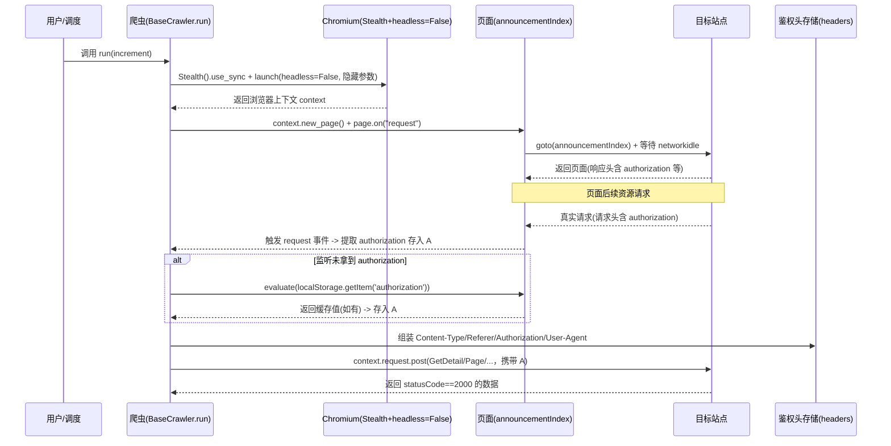
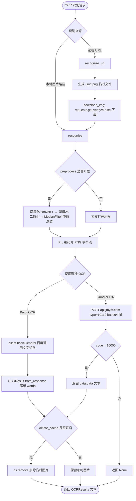

# bids-spider 实现细节-反爬对抗与验证码识别V1.0

| 文档版本 | 创建日期 | 修订简述 |
| --- | --- | --- |
| V1.0 | 2026-09-17 | 初版 |

## 目录

- [1 子系统概述](#1-子系统概述)
- [2 核心机制详解](#2-核心机制详解)
  - [2.1 浏览器层：自动化特征隐藏](#21-浏览器层自动化特征隐藏)
  - [2.2 行为层：随机延时与随机 UA](#22-行为层随机延时与随机-ua)
  - [2.3 请求认证层：请求头拦截与降级](#23-请求认证层请求头拦截与降级)
  - [2.4 验证码层：OCR 识别](#24-验证码层ocr-识别)
- [3 关键流程](#3-关键流程)
  - [3.1 请求头拦截流程](#31-请求头拦截流程)
  - [3.2 OCR 识别流程](#32-ocr-识别流程)
- [4 设计决策与权衡](#4-设计决策与权衡)
- [5 关键配置项](#5-关键配置项)
- [6 与其他子系统的关系](#6-与其他子系统的关系)
- [7 源码定位](#7-源码定位)
- [8 参考资料](#8-参考资料)

## 1 子系统概述

bids-spider 针对目标招标公告站点（天津公共资源交易网 `www.tjggzy.cn`、辽宁政府采购网 `www.ccgp-liaoning.gov.cn` 等）的访问控制与反爬策略，构建了四层对抗体系，全部体现在 `crawler/` 与 `utils/` 源码中：

| 层级 | 职责 | 主要载体 |
| --- | --- | --- |
| ① 浏览器层 | 隐藏 Playwright 自动化特征，以真实浏览器身份渲染页面 | `crawler/base_crawler.py`：`Stealth().use_sync(...)`、`headless=False`、`--disable-blink-features=AutomationControlled` |
| ② 行为层 | 通过随机延时、随机 User-Agent 模拟自然人访问节奏 | `crawler/base_crawler.py` 的 `_random_sleep`、根目录 `utils.py` 的 `UA.random` |
| ③ 请求认证层 | 拦截真实页面请求动态提取服务端校验头（`authorization`、`fn`），并组装 cookie / referer 等 | `crawler/tianjin.py`、`crawler/liaoning.py` 的 `page.on("request")` |
| ④ 验证码层 | 对验证码图片预处理后调用云端 OCR 识别文本 | `utils/captcha.py`：`BaiduOCR`、`YunMaOCR` |

四层之间为递进关系：浏览器层解决"页面能正常加载"，行为层解决"访问节奏不像爬虫"，请求认证层解决"带鉴权参数的 API 接口能通过校验"，验证码层解决"遭遇验证码拦截时能自动通过"。

需要特别说明的源码事实：**验证码层（`utils/captcha.py`）当前在四个省份爬虫（北京、河北、辽宁、天津）源码中均未被引用**，OCR 能力是独立工具模块，调用方待接入；现行爬虫链路主要通过浏览器层 + 行为层 + 请求认证层规避反爬，而非显式打码。

## 2 核心机制详解

### 2.1 浏览器层：自动化特征隐藏

浏览器层以 `playwright_stealth` 插件的 `Stealth` 类包装 Playwright 的同步 API，并配合自定义 Chromium 启动参数，使浏览器实例尽量接近普通用户使用的真实浏览器。

```python
with Stealth().use_sync(sync_playwright()) as p:
    browser = p.chromium.launch(
        headless=False,
        args=[
            '--no-sandbox',
            '--disable-setuid-sandbox',
            '--disable-blink-features=AutomationControlled',
            '--start-maximized'
        ]
    )
    context = browser.new_context()
```

各手段的作用如下：

| 手段 | 源码位置 | 作用 |
| --- | --- | --- |
| `Stealth().use_sync(sync_playwright())` | `base_crawler.run` | Stealth 插件注入反检测脚本，抹除 `navigator.webdriver` 等 Playwright 自动化特征（其具体注入脚本由第三方库实现，机制为库内部行为，非本仓库代码，以下为推断：覆盖 webdriver 标记、隐藏插件列表等） |
| `headless=False` | `chromium.launch` 参数 | 使用有头模式，不创建无头浏览器，避免被站点依据无头环境特征识别 |
| `--disable-blink-features=AutomationControlled` | `chromium.launch` 参数 | 关闭 Blink 引擎的"自动化控制"特性标记（该开关用于隐藏 `navigator.webdriver` 等自动化暴露项，其底层生效细节由 Chromium 决定） |
| `--no-sandbox`、`--disable-setuid-sandbox` | `chromium.launch` 参数 | 禁用 Chromium 沙箱，适配容器 / CI 等无权限环境运行（安全性由运行环境保障） |
| `--start-maximized` | `chromium.launch` 参数 | 以最大化窗口启动，窗口形态接近真实用户 |

说明：`browser.new_context()` 未显式传入 `user_agent`、`viewport` 等参数，即上下文沿用浏览器默认配置。

### 2.2 行为层：随机延时与随机 UA

行为层旨在让请求的时间间隔与身份标识不具备规律性。

**随机延时**：`BaseCrawler._random_sleep` 使用 `random.uniform(_min, _max)` 生成 `[1, 60]` 秒的均匀分布随机延时（默认参数 `_min=1, _max=60`），随后 `time.sleep` 阻塞。

```python
@staticmethod
def _random_sleep(_min=1, _max=60):
    sleep_seconds = random.uniform(_min, _max)
    time.sleep(sleep_seconds)
```

实际调用时可通过 `_max` 收敛范围：天津爬虫在每个招标详情请求后调用 `self._random_sleep(_max=30)`，即随机延时被限定为 `[1, 30]` 秒。

**随机 UA（旧版 requests 链路）**：根目录 `utils.py` 中 `Parser.get` / `Parser.post` 在调用方已传入 `headers` 时，会执行 `kwargs['headers'].update({'User-Agent': UA.random})` 注入 `fake_useragent` 生成的随机 UA；请求超时统一为 `REQUEST_TIMEOUT = 5` 秒。`fake_useragent` 从 `requirements.txt` 中 `fake_useragent` 依赖获得。

**新版浏览器链路**：`tianjin.py` 构造请求头时通过 `page.evaluate("navigator.userAgent")` 动态读取真实浏览器 UA，作为后续 API 请求的 `User-Agent`，保证请求头与页面会话一致（详见 2.3）。

### 2.3 请求认证层：请求头拦截与降级

请求认证层是天津、辽宁爬虫对抗目标站鉴权校验的核心机制。其共同思路是：**先用真实浏览器加载页面，在 `page.on("request")` 事件中监听页面发出的真实请求，从请求头中动态提取服务端下发的鉴权/防重放参数，再将该参数组装进后续 API 请求头**。这样无需预知服务端加密算法，只需"偷学"浏览器真实请求的头部。

#### 2.3.1 天津：拦截 `authorization`

天津公共资源交易网的 API 请求（`GetDetail`、`PageDictionaryItem`、`Announcement/Page`）需要携带 `authorization` 请求头。`TianJin._crawl` 的提取流程：

1. 注册请求监听，从页面发出的每个请求头中查找 `authorization` 并保存：

```python
def handle_request(request):
    headers = request.headers
    if 'authorization' in headers:
        self.authorization = headers['authorization']
page.on("request", handle_request)
page.goto("https://www.tjggzy.cn/announcementIndex")
page.wait_for_load_state("networkidle")
```

2. **localStorage 降级**：若页面加载完成（`networkidle`）后仍未通过监听拿到 `authorization`，则尝试从页面 `localStorage` 读取兜底：

```python
if not self.authorization:
    try:
        auth_storage = page.evaluate("() => localStorage.getItem('authorization')")
        if auth_storage:
            self.authorization = auth_storage
    except:
        pass
```

该降级说明站点存在将鉴权值写入 `localStorage` 的路径（其写入时机与触发条件由站点前端逻辑决定，源码未涉及，以下为推断：多数为登录后前端缓存）。

3. 组装完整请求头（`Content-Type`、`Referer`、`Authorization`、真实浏览器 UA）：

```python
self.headers = {
    "Content-Type": "application/json",
    "Referer": "https://www.tjggzy.cn/announcementIndex",
    "Authorization": self.authorization,  # 关键：带上提取的authorization
    "User-Agent": page.evaluate("navigator.userAgent")
}
```

4. 后续所有 API 调用通过 `context.request.post(url, data=..., headers=self.headers)` 发起，响应以 `data.get("statusCode") != 2000` 判定失败。

#### 2.3.2 辽宁：拦截 `fn` 头 + 响应头回收 + cookie 拼接

辽宁爬虫（`LiaoNing._crawl`）的请求头组装比天津更依赖真实会话，其数据来源包括拦截请求头、真实响应头、浏览器 cookie 三类：

1. 拦截请求中的 `fn` 头（该头为辽宁站点服务端下发的防重放/校验头，具体生成机制由站点决定，以下为推断：可能为请求签名或会话标识）：

```python
def handle_request(request):
    headers = request.headers
    if 'fn' in headers:
        self.headers['fn'] = headers['fn']
page.on("request", handle_request)
resp = page.goto(self.url, wait_until="domcontentloaded")
```

2. **响应头回收**：将首页真实响应头全量并入请求头（`self.headers.update(resp.headers)`），直接复用站点返回的响应头字段。

3. 追加固定头并**拼接 cookie**：

```python
self.headers.update({
    'content-type': 'application/json;charset=UTF-8',
    'access-control-allow-origin': '*/*',
    'isloading': 'true',
})
self._parse_cookie(page.context.cookies())
```

`_parse_cookie` 从浏览器上下文读取全部 cookie，遍历后以 `cookie['name'] + '=' + cookie['value']` 形式写入 `self.headers['cookie']`。需注意的源码事实：该遍历为**覆盖式赋值**，循环结束后 `headers['cookie']` 仅保留最后一个 cookie，未做多 cookie 拼接合并（以下为推断：此实现可能因目标站点接口仅依赖单一 cookie 而可用，若依赖多个 cookie 可能存在会话不完整风险）。

4. 列表接口 `getHomePunInfoList` 通过 `context.request.post` 携带组装后的 `self.headers` 调用，响应以 `data.get("code") != 200` 判定失败；详情页跳转直接使用 `page.goto(record[1], wait_until="domcontentloaded")`（源码注释标注 `TODO: resp1.body() 乱码 charset=gb2312`，即详情页响应体存在 gb2312 编码乱码问题，尚未处理）。

### 2.4 验证码层：OCR 识别

`utils/captcha.py` 提供两类云端 OCR 能力：`BaiduOCR`（百度 AI 通用文字识别 `AipOcr.basicGeneral`）与 `YunMaOCR`（云码平台 `api.jfbym.com`）。两者共同点：识别前对验证码图片做预处理以提高准确率，识别成功后默认清理临时图片。

**模块现状（源码事实）**：本模块在四个省份爬虫源码中均未被引用，`requirements.txt` 中对应依赖（`baidu-aip`、`pillow`、`pytesseract`、`opencv-python`）与模块配套；模块导入了 `cv2`、`numpy`、`pytesseract`，但预处理实现实际基于 PIL 逐像素处理（未调用 cv2 接口，以下为推断：相关导入为预留或历史遗留）。

#### 2.4.1 凭据校验

`_ensure_credentials(app_id, api_key, secret_key)` 检查三个凭据是否缺失，缺失任一即抛异常，避免带空凭据调用付费接口：

```python
def _ensure_credentials(app_id, api_key, secret_key) -> None:
    missing = [name for name, value in {
        "app_id": app_id,
        "api_key": api_key,
        "secret_key": secret_key,
    }.items() if not value]
    if missing:
        raise ValueError(f"Missing Baidu OCR credential(s): {', '.join(missing)}")
```

`BaiduOCR.__init__` 构造时即调用 `_ensure_credentials`；`BaiduOCR.from_env` 通过 `os.getenv` 读取 `BAIDU_OCR_APP_ID / BAIDU_OCR_API_KEY / BAIDU_OCR_SECRET_KEY` 环境变量，读取为空时仍会进入构造器被校验拦截。

#### 2.4.2 BaiduOCR 图片预处理算法

`preprocess_image` 将验证码转换为高对比度黑白图，三步处理：

| 步骤 | 实现 | 说明 |
| --- | --- | --- |
| 灰度化 | `Image.open(image_path).convert("L")` | 转为 8 位灰度图，去除颜色干扰 |
| 阈值二值化 | 逐像素 `255 if int(pix) > self.threshold else 0` | 阈值 `DEFAULT_THRESHOLD = 25`：像素值大于 25 置白（255），否则置黑（0），初始画布为全白 |
| 中值滤波 | `processed.filter(ImageFilter.MedianFilter())` | PIL 中值滤波，抑制椒盐噪点，平滑字符边缘 |

```python
def preprocess_image(self, image_path, *, save_processed=False):
    image = Image.open(image_path).convert("L")
    processed = Image.new("L", image.size, 255)
    for y in range(image.size[1]):
        for x in range(image.size[0]):
            pix = image.getpixel((x, y))
            processed.putpixel((x, y), 255 if int(pix) > self.threshold else 0)
    processed = processed.filter(ImageFilter.MedianFilter())
    if save_processed:
        processed.save(image_path)
    return processed
```

`save_processed=True` 时将预处理结果覆盖写回原路径，便于调试留存。

#### 2.4.3 BaiduOCR 识别调用链

`recognize(image_path, *, preprocess=True, save_processed=False, delete_cache=True)`：

1. 按 `preprocess` 开关预处理（默认开启）或直接打开原图；
2. `_image_to_bytes` 将 PIL 图像编码为 PNG 字节流；
3. 调用 `self.client.basicGeneral(image_bytes)` 百度通用文字识别接口；
4. `delete_cache=True`（默认）时 `os.remove(image_path)` 清理临时图片；
5. 经 `OCRResult.from_response` 将响应解析为 `OCRResult(words: List[str])`（遍历 `words_result` 提取 `words` 并 `strip`）。

`recognize_url(url, delete_cache=True)` 用于识别远程验证码：以 `str(uuid.uuid4()) + '.png'` 生成唯一临时文件名，`download_img` 用 `requests.get(url, verify=False)`（关闭 SSL 校验）下载后调用 `recognize`。

#### 2.4.4 YunMaOCR 接口协议

`YunMaOCR` 面向云码打码平台，构造时仅需 `token`：

| 协议项 | 值 | 说明 |
| --- | --- | --- |
| 请求地址 | `http://api.jfbym.com/api/YmServer/customApi` | 云码平台自定义 API |
| 请求方法 | `POST` | 请求体 `Content-Type: application/json` |
| 请求参数 | `token`、`type`、`image` | `image` 为图片文件 base64 编码字符串 |
| `type` | `10110` | 通用数英（≤5 位），源码注释标注 |
| 成功判定 | `code == 10000` | 成功则返回 `response["data"]["data"]`，否则返回 `None` |

```python
data = {
    "token": self.token,
    "type": "10110",  # 通用数英（≤5位）
    "image": image_data,
}
response = requests.post(self.url, headers=_headers, json=data)
response = response.json()
if response.get("code") == 10000:
    return response.get("data", {}).get("data", "")
return None
```

`YunMaOCR.recognize` 返回识别文本字符串（失败返回 `None`），与 `BaiduOCR.recognize` 返回 `OCRResult(words)` 的数据结构不同。

## 3 关键流程

### 3.1 请求头拦截流程

以天津 `authorization` 提取为例（辽宁 `fn` 提取流程结构相同，仅字段名与降级步骤不同），完整时序如下：



### 3.2 OCR 识别流程



## 4 设计决策与权衡

| 决策 | 源码依据 | 权衡分析 |
| --- | --- | --- |
| 用 Stealth 插件 + 有头模式而非纯 headless | `base_crawler.py` 的 `Stealth().use_sync(...)` 与 `headless=False` | 有头模式更接近真实用户，规避站点对无头浏览器指纹的检测，代价是需真实图形环境、占用系统资源；headless 通常更轻量但更易被识别（以下为推断） |
| 隐藏特征用启动参数而非纯 JS 注入 | `--disable-blink-features=AutomationControlled` | 从浏览器进程层面关闭自动化控制特性，比运行时 JS 抹除更前置；该参数并不能覆盖全部检测面，故叠加 Stealth 插件（以下为推断） |
| 请求头用"拦截真实请求动态提取"而非硬编码 | `tianjin.py`、`liaoning.py` 的 `page.on("request")` | `authorization`、`fn` 等由服务端下发且可能动态变化，硬编码易失效；动态提取无需理解加密算法，但依赖"先用真实浏览器完成页面加载"这一前置 |
| 天津提供 localStorage 降级 | `tianjin.py` 的 `page.evaluate("...localStorage...")` | 请求监听存在取不到 `authorization` 的可能（如请求未带该头），localStorage 作为第二数据源提高鲁棒性；获取失败时静默 `except: pass` |
| 辽宁复用真实响应头 | `liaoning.py` 的 `self.headers.update(resp.headers)` | 将真实响应头字段并入请求头，最大程度还原真实会话；代价是可能携带无关/冗余头 |
| 随机延时区间可配置 | `base_crawler.py` 的 `_random_sleep(_min=1, _max=60)` 与 `tianjin.py` 的 `_random_sleep(_max=30)` | 基类默认 `[1,60]` 秒较宽泛，子类按需收敛（天津详情接口收敛为 `[1,30]`），在隐蔽性与采集效率间取舍 |
| 旧版 selenium 用 `--headless` + `excludeSwitches`，新版改用 Playwright Stealth + 有头 | `utils.py` 的 `make_driver` 与 `base_crawler.py` 的 `run` | 演进方向：旧版以 `--headless` + `excludeSwitches ['enable-automation']` + 固定 UA 隐藏自动化；新版以 Stealth 插件 + `--disable-blink-features=AutomationControlled` + 有头模式 + 动态 UA，隐蔽性更强（以下为推断：新版方案为应对更强反爬的迭代） |
| 百度 OCR 凭据缺失即抛错 | `captcha.py` 的 `_ensure_credentials` | 避免携带空凭据调用付费接口导致无效计费/静默失败，用异常显式暴露配置缺失 |
| OCR 图片默认删除 | `captcha.py` 的 `recognize(delete_cache=True)` | 默认清理临时验证码图片，防止本地堆积；需要调试时以 `delete_cache=False` 保留 |
| OCR 模块与爬虫解耦 | grep 结果显示四个爬虫源码均未引用 `captcha.py` | 将验证码识别做成独立工具模块，避免主链路强依赖第三方付费服务；当前版本靠前三层规避反爬，未接入打码，说明当前目标站点未强制触发验证码（以下为推断） |

## 5 关键配置项

| 配置项 | 默认值/取值 | 位置 | 说明 |
| --- | --- | --- | --- |
| 浏览器启动参数 | `--no-sandbox`、`--disable-setuid-sandbox`、`--disable-blink-features=AutomationControlled`、`--start-maximized` | `base_crawler.run` → `chromium.launch(args=...)` | 隐藏自动化特征 + 适配运行环境 |
| 有头/无头 | `headless=False` | `base_crawler.run` → `chromium.launch` | 有头模式，当前不支持通过参数切换 |
| 页面加载等待 | `wait_until="domcontentloaded"`；天津等待 `networkidle` | `base_crawler._execute_by_new_page`、`tianjin.py` | 天津主页面额外等待网络空闲以触发拦截 |
| 随机延时范围 | 基类 `[1, 60]` 秒；天津详情后 `_max=30` 秒（`[1,30]`） | `base_crawler._random_sleep`、`tianjin.py` | `random.uniform` 均匀分布 |
| requests 超时 | `REQUEST_TIMEOUT = 5`（秒） | `utils.py` | 旧版 Parser 链路 |
| 随机 UA | `UA.random` | `utils.py` | `fake_useragent` 生成；新版浏览器链路用 `page.evaluate("navigator.userAgent")` |
| 旧版浏览器 UA | 固定 `Chrome/73.0.3683.86` | `utils.py` 的 `make_driver` | phantomjs 与 chrome 共用该 UA 字符串 |
| 百度 OCR 环境变量 | `BAIDU_OCR_APP_ID`、`BAIDU_OCR_API_KEY`、`BAIDU_OCR_SECRET_KEY` | `captcha.py` 的 `from_env` | 前缀 `BAIDU_OCR_` 可通过 `from_env(prefix=...)` 调整 |
| 二值化阈值 | `DEFAULT_THRESHOLD = 25` | `captcha.py` | 像素值 > 25 置白，否则置黑；可通过构造器 `threshold=` 覆盖 |
| 云码 token | 构造器入参 `YunMaOCR(token)` | `captcha.py` | 云码平台账号令牌 |
| 云码 URL | `http://api.jfbym.com/api/YmServer/customApi` | `captcha.py` | 云码自定义 API 地址 |
| 云码 type | `10110`（通用数英 ≤5 位） | `captcha.py` | 识别类型码，成功判定 `code == 10000` |
| 远程图片下载 | `requests.get(url, verify=False)` | `captcha.py` 的 `download_img` | 关闭 SSL 校验 |

## 6 与其他子系统的关系

**与 Playwright 抓取引擎的关系**：反爬对抗体系是 Playwright 抓取引擎的组成部分。`base_crawler.py` 既是浏览器层的载体（启动带 Stealth 的浏览器），也是所有省份爬虫的基类，其 `run()` 在 `finally` 中完成数据落库（`save_tenders_to_es` 写入 Elasticsearch、`save_tenders_to_excel` 用 pandas 导出 Excel），与数据存储子系统直接衔接。请求认证层的拦截发生在 Playwright 页面会话内，提取的鉴权头通过 `context.request` 复用同一会话上下文。

**与数据存储的关系**：抓取数据写入 Elasticsearch（`utils/es.py`），`get_exists_url_from_es` 按 `region` 查询已有公告 ID 用于增量去重，避免重复采集——去重机制同时降低了无效请求量，间接减少反爬触发面。数据为结构化招标公告（标题、发布日期、正文 HTML 等）。

**与验证码 OCR 模块的关系**：`utils/captcha.py` 是面向验证码拦截场景的独立工具模块，当前**未被任何省份爬虫引用**（源码事实）。它与 PRD 中"反爬规避与验证码识别"功能模块相对应，为规划中的打码能力预留；现行爬虫依靠浏览器层、行为层、请求认证层规避反爬，未走到显式打码环节。该模块配套依赖（`baidu-aip`、`pytesseract`、`opencv-python`、`pillow`）已列入 `requirements.txt`，凭据读取约定为 `BAIDU_OCR_*` 环境变量。

## 7 源码定位

| 关键文件 | 关键类 / 方法 / 常量 | 说明 |
| --- | --- | --- |
| `crawler/base_crawler.py` | `BaseCrawler.run`、`BaseCrawler._random_sleep`、`BaseCrawler._execute_by_new_page` | 浏览器层（Stealth 启动、有头模式、隐藏参数）与行为层（随机延时 `[1,60]`） |
| `crawler/tianjin.py` | `TianJin._crawl`、`handle_request`、`TianJin.headers`、`TianJin._get_tender_details` / `_get_tender_list` / `_get_page_dictionary` | 请求认证层：拦截 `authorization`、localStorage 降级、组装请求头；`_random_sleep(_max=30)` |
| `crawler/liaoning.py` | `LiaoNing._crawl`、`handle_request`、`LiaoNing._parse_cookie`、`LiaoNing._get_tenders_list` | 请求认证层：拦截 `fn`、响应头回收、cookie 拼接、追加固定头 |
| `utils/captcha.py` | `BaiduOCR`、`BaiduOCR.preprocess_image`、`BaiduOCR.recognize` / `recognize_url` / `download_img`、`BaiduOCR.from_env`、`YunMaOCR`、`OCRResult`、`_ensure_credentials`、`DEFAULT_THRESHOLD` | 验证码层：图片预处理（灰度 + 阈值 25 二值化 + 中值滤波）、百度 OCR、云码接口；独立模块，爬虫未引用 |
| `utils.py` | `Parser.get` / `Parser.post`、`UA`、`REQUEST_TIMEOUT`、`make_driver`、`random_sleep` | 旧版 requests 链路随机 UA 注入与超时；旧版 selenium headless chrome / phantomjs 配置（对比演进用） |
| `requirements.txt` | `playwright-stealth`、`baidu-aip`、`pytesseract`、`opencv-python`、`pillow`、`fake_useragent`、`playwright` | 反爬与 OCR 相关依赖清单 |

## 8 参考资料

- `crawler/base_crawler.py`（Stealth 使用、chromium.launch 参数、`_random_sleep`）
- `crawler/tianjin.py`（`authorization` 拦截、localStorage 降级、请求头组装）
- `crawler/liaoning.py`（`fn` 拦截、`_parse_cookie`、响应头回收）
- `utils/captcha.py`（BaiduOCR 预处理与识别、YunMaOCR 接口协议、凭据校验）
- `utils.py`（`Parser` 随机 UA、`REQUEST_TIMEOUT`、`make_driver` 旧版配置、`random_sleep`）
- `requirements.txt`（依赖清单）
- 项目相关文档：`docs/outcome/bids-spider产品需求文档V1.0.md`、`docs/outcome/bids-spider实现细节-Playwright抓取引擎V1.0.md`
