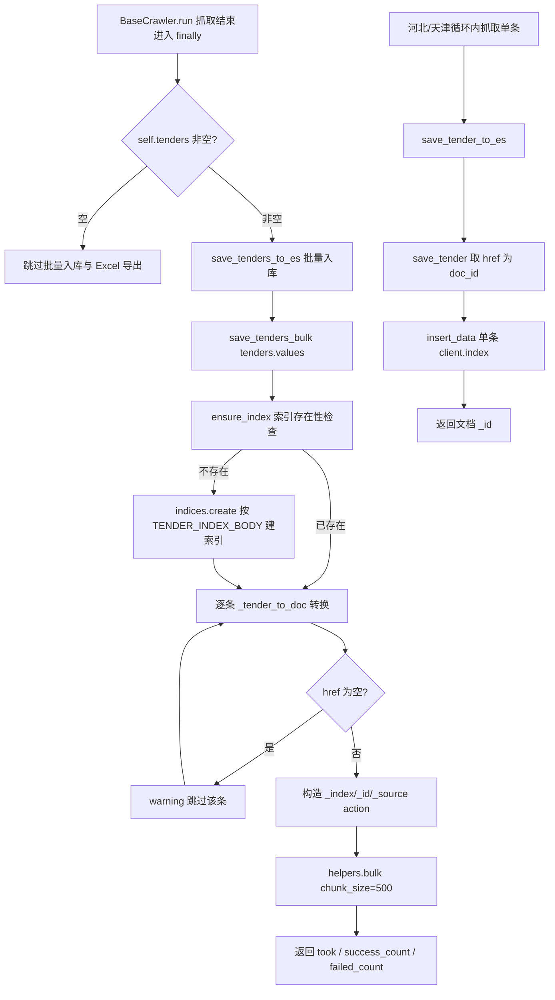
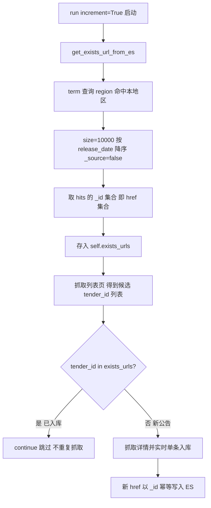

# bids-spider 实现细节-数据存储与去重机制V1.0

| 文档版本 | 创建日期 | 修订简述 |
| --- | --- | --- |
| V1.0 | 2026-09-17 | 初版：梳理 Elasticsearch 索引结构与映射、href 幂等去重、单条/批量落库两种模式、旧版 MongoDB 存储与 Excel 导出 |

## 目录

- [1 子系统概述](#1-子系统概述)
- [2 核心机制详解](#2-核心机制详解)
  - [2.1 新版存储核心：Elasticsearch 索引结构与映射](#21-新版存储核心elasticsearch-索引结构与映射)
  - [2.2 Tender 数据模型与 ES 文档转换](#22-tender-数据模型与-es-文档转换)
  - [2.3 href 幂等去重机制](#23-href-幂等去重机制)
  - [2.4 单条入库与批量入库](#24-单条入库与批量入库)
  - [2.5 增量去重查询：get_exists_url_from_es](#25-增量去重查询get_exists_url_from_es)
  - [2.6 旧版 MongoDB 存储](#26-旧版-mongodb-存储)
  - [2.7 Excel 导出](#27-excel-导出)
  - [2.8 连接诊断与版本兼容](#28-连接诊断与版本兼容)
- [3 关键流程](#3-关键流程)
  - [3.1 新版写入流程](#31-新版写入流程)
  - [3.2 增量去重流程](#32-增量去重流程)
  - [3.3 两种落库模式对比](#33-两种落库模式对比)
- [4 设计决策与权衡](#4-设计决策与权衡)
- [5 关键配置项](#5-关键配置项)
- [6 与其他子系统的关系](#6-与其他子系统的关系)
- [7 源码定位](#7-源码定位)
- [8 参考资料](#8-参考资料)

## 1 子系统概述

数据存储与去重是 bids-spider 的持久化层，负责将各省级爬虫产出的招标公告记录（`Tender`）落库、按地区增量去重，并支持导出交付。项目演进出两套并存方案：

- **新版（Elasticsearch 核心）**：代码位于 `utils/es.py` 与 `crawler/base_crawler.py`。以本地 Elasticsearch 集群为结构化存储，索引 `tenders`，六字段映射；以公告 `href` 作为 ES 文档 `_id`，利用 ES 同 id 覆盖写实现幂等去重；提供单条（`save_tender`）与批量（`save_tenders_bulk`，chunk 500）两种写入方式；增量模式下先查询本地区已存在 `_id` 集合（即 href 集合）作为去重基线。辅以 `pandas` 导出 `{地区}_{时间戳}.xlsx`。
- **旧版（MongoDB 存储）**：代码位于 `utils.py` 与 `gov_parser.py`。配置驱动链路将抓取到的 URL 与正文纯文本批量写入 MongoDB `bids` 库 `bids` 集合，文档形如 `{url, text}`，无去重字段设计。

本子系统与抓取引擎解耦：`BaseCrawler.run()` 在 `try/finally` 中兜底执行落库与导出，存储层仅消费 `Tender` 数据，不关心列表页取数与详情页抓取细节。

## 2 核心机制详解

### 2.1 新版存储核心：Elasticsearch 索引结构与映射

`utils/es.py` 定义默认索引名 `DEFAULT_TENDER_INDEX = "tenders"`，索引映射体 `TENDER_INDEX_BODY` 同时指定 settings 与 mappings：

```python
TENDER_INDEX_BODY = {
    "settings": {
        "number_of_shards": 1,
        "number_of_replicas": 0,
    },
    "mappings": {
        "dynamic": "false",
        "properties": { ... },
    },
}
```

映射共六个字段，字段类型选择遵循"精确匹配用 keyword、全文检索用 text、存储不检索用 index:false"的原则：

| 字段 | 类型 | 说明 |
| --- | --- | --- |
| `region` | `keyword` | 地区标识，作为去重查询与分区检索的精确匹配键 |
| `href` | `keyword` | 公告唯一标识，写入时作为文档 `_id`，冗余存储便于查询展示 |
| `title` | `text` + `keyword` 子字段 | `keyword` 子字段带 `ignore_above: 256`，支持全文检索与精确排序/聚合 |
| `release_date` | `keyword` | 发布日期文本（站点原始形态，未格式化），keyword 类型保证可排序 |
| `crawl_date` | `date` | 抓取时间，格式 `yyyy-MM-dd HH:mm:ss\|\|strict_date_optional_time\|\|epoch_millis` 三选一解析 |
| `html` | `text`，`index: false` | 详情页正文 HTML，仅存储不建立倒排索引，避免大字段索引膨胀 |

`mappings.dynamic: "false"` 表示未声明字段不自动建映射、不索引入库，保证文档结构受控。

### 2.2 Tender 数据模型与 ES 文档转换

`Tender` 定义于 `crawler/base_crawler.py`，为 `@dataclass` 类，六字段与 ES 映射一一对应：

| 字段 | 类型 | 默认值 | 语义 |
| --- | --- | --- | --- |
| `region` | `str` | 无（必填） | 地区标识，与 ES 映射 `region` 一致 |
| `href` | `str` | 无（必填） | 公告唯一标识（北京/河北为详情页 URL，天津为接口 `announcementId`） |
| `title` | `str` | 无（必填） | 公告标题 |
| `release_date` | `str` | `''` | 发布日期文本 |
| `html` | `str` | `''` | 详情页正文 HTML |
| `crawl_date` | `str` | `''` | 抓取时间，格式 `%Y-%m-%d %H:%M:%S`，由 `_get_crawl_date()` 生成 |

`ESConnection._tender_to_doc(tender)` 负责将 `Tender` 转换为 ES 文档：

- `dataclass` 实例经 `asdict` 转字典；`Mapping`（dict）直接拷贝；其他类型抛 `TypeError`；`None` 抛 `ValueError`；
- 转换后对六字段执行 `setdefault` 兜底为空字符串，保证缺省字段也能写入。

### 2.3 href 幂等去重机制

幂等去重的核心是"以 `href` 作为文档 `_id` 写入"：

- `save_tender`：取 `doc.get("href")` 作为 `doc_id`，为空则报错并跳过（`tender href is empty, skip saving.`）；
- `save_tenders_bulk`：逐条取 `href` 作为 `_id`，缺失者打印 warning 后跳过，不进入批量 action；
- `insert_data` 底层调用 `client.index(index=..., id=doc_id, document=...)`。

由于 ES 对同一索引内相同 `_id` 执行覆盖写（upsert 语义），同一公告重复抓取时会以新文档整体替换旧文档，因此**同一 `href` 永不产生重复文档**。该机制同时约束了上游：`href` 必须在站内语义唯一，否则会误合并不同公告（河北用详情页 URL，天津用 `announcementId`，均满足站点侧唯一性）。

### 2.4 单条入库与批量入库

`ESConnection` 提供两条写入路径，均先经 `ensure_index` 保证索引存在（不存在时按 `TENDER_INDEX_BODY` 自动创建）：

| 路径 | 方法 | 行为 |
| --- | --- | --- |
| 单条 | `save_tender(tender)` | 转换文档 → 取 href 为 `doc_id` → `insert_data` 单条 `client.index` 写入，返回文档 `_id` |
| 批量 | `save_tenders_bulk(tenders, chunk_size=500)` | 构造 `{_index, _id, _source}` action 列表 → `helpers.bulk(..., chunk_size=500, raise_on_error=False, stats_only=False)` |

批量路径的返回与异常处理：

- 全部记录缺 href（actions 为空）时返回 `None`，日志 `No valid tender data to save.`；
- 正常执行返回 `{"took": resp[1], "success_count": resp[0], "failed_count": len(actions) - resp[0]}`，即 ES 返回的耗时、成功数与失败数（失败数由总 action 数减成功数推算）；
- `raise_on_error=False` 使单条失败不中断整体批量；异常时返回 `None`。

`ESConnection.__del__` 自动调用 `close_connection()` 关闭客户端。

### 2.5 增量去重查询：get_exists_url_from_es

`BaseCrawler.get_exists_url_from_es()` 在每轮 `run()` 开始时执行一次，构建去重基线。查询体固定为：

```python
{
    "query": {"term": {"region": self.region}},
    "sort": [{"release_date": {"order": "desc"}}],
    "_source": False,
    "size": 10000,
}
```

机制要点：

- `term` 精确匹配当前爬虫的 `region`，只取本地区历史数据；
- `sort` 按 `release_date` 降序（映射中该字段为 `keyword`，可排序）；
- `_source: false` 不返回文档内容，仅返回元数据，减少数据传输量；
- `size: 10000` 为单次查询返回上限；
- 结果处理为 `set(i['_id'] for i in data)`——**文档 `_id` 即写入时的 `href`，故 `_id` 集合等价于已入库 href 集合**，直接作为 `self.exists_urls` 判重依据，无需额外读取 `_source`。

限制：单地区历史数据超过 `size` 上限后，超出部分无法进入去重基线（推测：数据量大时需调大 `size` 或改用 scroll/复合查询）。

### 2.6 旧版 MongoDB 存储

旧版配置驱动链路（`gov_parser.py` + `utils.py`）的存储层：

- `connect_col()`：`MongoClient()[DB]`（`DB = 'bids'`）并返回 `db.bids`，即 **`bids` 库 `bids` 集合**；
- `Parser.save_text(urls)`：对每个 URL 调用 `url2text`（requests 取页 → html2text 去除链接与图片），构造 `[{'url': url, 'text': text}]` 列表后 `col.insert_many(text_list)` 批量入库；
- 文档结构仅 `{url, text}` 两个键，无唯一索引、无 `_id` 设计约束，**无去重机制**，重复抓取会积累重复记录（PRD 亦标注该点）。

旧版链路中的 `load_urls(filename)` 从 CSV 读取 URL 并去重为 `set`，属 CSV 清单链路的辅助去重，与 MongoDB 存储层无关。

### 2.7 Excel 导出

`BaseCrawler.save_tenders_to_excel()` 在 `run()` 的 `finally` 中执行，将本地区本轮抓取的 `Tender` 导出为 Excel：

- `self.tenders` 为空时跳过（`Nothing to save.`）；
- 否则 `[asdict(tender) for tender in self.tenders.values()]` 构造 DataFrame，`pd.DataFrame(data).to_excel(file_name)` 导出；
- 文件名由当前时间戳拼装：`str(datetime.now())` 将空格、`-`、`:`、`.` 全部替换为 `_`，再拼接地区前缀，形如 `beijing_2026_09_17_10_30_00.xlsx`；
- 文件写入当前工作目录（相对路径，未指定子目录）。

### 2.8 连接诊断与版本兼容

`ESConnection` 提供三层诊断/兼容保障：

| 方法 | 行为 |
| --- | --- |
| `check_es_version()` | 构造时调用。检测 `elasticsearch` 客户端版本，`version[0] >= 9` 时打印警告，提示可能与 ES 8.x 不兼容，并建议 `pip install 'elasticsearch<9.0.0'`；检测异常时放行返回 `True` |
| `create_connection()` | 按硬编码 `host` 与 `basic_auth` 创建客户端，`request_timeout=10`、`max_retries=3`、`retry_on_timeout=False`、`http_compress=False`；失败置 `es=None` |
| `test_connection()` | `client.info()` 获取版本号与集群名并打印，验证连通性 |

连接采用懒加载：`_client()` 在 `es` 为 `None` 时自动 `create_connection()`。`utils/es.py` 的 `__main__` 提供示例：建连 → 测试连接 → 按 `term region=beijing` 查询并打印命中文档。

## 3 关键流程

### 3.1 新版写入流程

新版写入分两条分支：基类批量入库（北京模式）与实时单条入库（河北/天津模式），二者底层都汇入 `ESConnection` 的索引保障与幂等写入：



### 3.2 增量去重流程

增量去重以"ES 内已存在 `_id` 集合"为基线，抓取前预加载、抓取中逐条比对（天津爬虫为显式实现）：



### 3.3 两种落库模式对比

| 维度 | 北京批量入库 | 河北/天津单条入库 |
| --- | --- | --- |
| 触发位置 | `run()` 的 `finally`，整轮抓取结束后 | 抓取循环体内，每拿到一条详情立即写入 |
| 调用链 | `save_tenders_to_es()` → `save_tenders_bulk()`（chunk 500） | `save_tender_to_es()` → `save_tender()` → `insert_data()` |
| 去重方式 | 依赖 href 幂等覆盖写 | 天津显式 `exists_urls` 增量过滤 + 幂等覆盖写；河北未做增量过滤（推测：河北列表页仅返回最新列表，靠 href 幂等兜底） |
| `self.tenders` 使用 | 累积全部记录，供批量入库与 Excel 导出 | 河北不写入 `self.tenders`（故不导 Excel）；天津写入 `self.tenders`，`finally` 中还会再批量写入一次，因 `_id` 相同被幂等覆盖（推测：双写为兼顾实时入库与 Excel 导出） |
| 实时性 | 低（轮末统一写） | 高（边抓边写） |

## 4 设计决策与权衡

| 决策 | 权衡分析 |
| --- | --- |
| `href` 作为文档 `_id` 而非自增 id | 直接获得"同公告覆盖写"的幂等去重，无需额外判重逻辑；代价是 `href` 必须语义唯一，且文档更新策略为整体替换 |
| `region`/`href`/`release_date` 用 `keyword` | 精确匹配、聚合、排序（`sort release_date desc`）需要不可分词的 keyword 类型；`release_date` 保持站点原始文本，未做统一日期清洗 |
| `title` 双类型（text + keyword） | 兼顾全文检索（`text`）与精确聚合/排序（`keyword` 子字段，`ignore_above 256` 截断超长标题）；代价是索引体积略增 |
| `html` 仅存储不索引（`index: false`） | 正文 HTML 体积大且以存储为主，不建倒排索引可显著降低索引膨胀；代价是 `html` 字段不可检索 |
| `mappings.dynamic: false` | 锁定文档结构，杜绝脏字段与类型错乱；新增字段必须显式改映射 |
| 批量写入 chunk 500 + `raise_on_error=False` | 平衡吞吐与容错：单条失败不中断整体；返回成功/失败计数供审计 |
| 去重查询 `size=10000` 单次拉取 | 简单够用；数据量超过 1 万后去重基线不完整（推测：需 scroll 或按日期分段） |
| 新版 ES 与旧版 MongoDB 并存 | 保留历史链路不破坏既有数据；新抓取统一走 ES，MongoDB 仅承载旧数据 |
| ES 连接凭据硬编码于源码 | 快速起步、免配置；明文口令入库存在泄露风险，仅适合本地单机环境（安全隐患，见 5 章） |
| 每轮 `finally` 强制落库 + 导出 | 抓取异常也不丢失已采集数据；代价是每轮固定触发一次批量写入与 Excel 导出开销 |

## 5 关键配置项

| 配置项 | 取值 | 定义位置 | 说明 |
| --- | --- | --- | --- |
| ES `host` | `http://127.0.0.1:9200` | `utils/es.py` 模块常量 | 硬编码，本地单机 ES |
| ES 认证 | `basic_auth=(superuser_name, superuser_pwd)` | `utils/es.py` 模块常量 | 超级用户口令明文硬编码于源码（安全风险） |
| 默认索引名 | `tenders` | `utils/es.py` `DEFAULT_TENDER_INDEX` | 写入与查询的默认索引 |
| 分片数 `number_of_shards` | `1` | `TENDER_INDEX_BODY.settings` | 单分片 |
| 副本数 `number_of_replicas` | `0` | `TENDER_INDEX_BODY.settings` | 无副本，仅本地存储 |
| 动态映射 `dynamic` | `false` | `TENDER_INDEX_BODY.mappings` | 未声明字段不索引 |
| 六字段映射 | 见 2.1 表 | `TENDER_INDEX_BODY.mappings.properties` | region/href keyword、title text+keyword（ignore_above 256）、release_date keyword、crawl_date date、html text index:false |
| 批量 `chunk_size` | `500` | `ESConnection.save_tenders_bulk` 参数 | 每批次写入条数 |
| 去重查询 `size` 上限 | `10000` | `BaseCrawler.get_exists_url_from_es` 查询体 | 单次返回最大文档数 |
| `request_timeout` | `10`（秒） | `ESConnection.create_connection` | 请求超时 |
| `max_retries` | `3` | `ESConnection.create_connection` | 最大重试次数 |
| `retry_on_timeout` | `False` | `ESConnection.create_connection` | 超时不重试 |
| `http_compress` | `False` | `ESConnection.create_connection` | 不启用 HTTP 压缩 |
| MongoDB 库名 | `bids` | `utils.py` `DB` 常量 | 旧版存储库 |
| MongoDB 集合 | `bids` | `utils.py` `connect_col()` | 旧版存储集合，文档 `{url, text}` |
| Excel 文件名 | `{region}_{时间戳}.xlsx` | `BaseCrawler.save_tenders_to_excel` | 时间戳为 `datetime.now()` 全替换 `_`，写当前工作目录 |

## 6 与其他子系统的关系

- **与 Playwright 抓取引擎的关系**：`crawler/base_crawler.py` 是连接点——`BaseCrawler` 持有 `ESConnection` 实例，`run()` 的 `finally` 兜底调用 `save_tenders_to_es()`（批量）与 `save_tenders_to_excel()`；各省爬虫（河北/天津）在循环体内调用 `save_tender_to_es()` 实时单条入库。抓取引擎只产出 `Tender`，落库细节全部收敛于 `utils/es.py`。
- **与反爬的关系**：每条详情抓取后的 `_random_sleep`（河北/天津 `_max=30`，基类默认 1~60 秒）在写库节奏前插入随机延时，间接拉长写入频率；天津通过拦截请求头获取 `authorization` 属抓取侧鉴权，与存储层无直接耦合。
- **与旧版配置驱动链路的关系**：旧版 `gov_parser.py`（`Bid.get_urls`/`post_data`）+ `utils.py`（`Parser.save_text`）将数据写入 MongoDB `bids` 库 `bids` 集合，无去重；新版 `crawler/` + `utils/es.py` 以 ES 为核心实现幂等去重。两链路并存，旧版不消费 ES。
- **与日志子系统的关系**：`utils/es.py` 与 `crawler/base_crawler.py` 均依赖 `utils.log.logger`，贯穿连接建立、索引创建、单条/批量写入、去重查询全过程，写入结果可审计。
- **与 PRD 的对应关系**：对应产品需求文档 `bids-spider产品需求文档V1.0.md` 第 4.3 节「数据存储与去重」——4.3.1 Elasticsearch 结构化存储、4.3.2 MongoDB 旧版存储、4.3.3 Excel 导出，本文档为这三节的实现级展开。

## 7 源码定位

| 功能 | 文件（相对路径） | 类/方法 |
| --- | --- | --- |
| ES 连接、索引管理、增删改查 | `utils/es.py` | `ESConnection`（`create_connection`/`test_connection`/`ensure_index`/`insert_data`/`delete_data`/`update_data`/`search_data`/`delete_index`/`close_connection`/`check_es_version`） |
| 索引映射定义 | `utils/es.py` | `TENDER_INDEX_BODY`、`DEFAULT_TENDER_INDEX` |
| 单条入库 | `utils/es.py` | `ESConnection.save_tender` |
| 批量入库 | `utils/es.py` | `ESConnection.save_tenders_bulk` |
| 文档转换 | `utils/es.py` | `ESConnection._tender_to_doc` |
| 示例查询 | `utils/es.py` | `__main__` |
| Tender 数据模型 | `crawler/base_crawler.py` | `Tender`（dataclass） |
| 增量去重查询 | `crawler/base_crawler.py` | `BaseCrawler.get_exists_url_from_es` |
| 批量落库入口 | `crawler/base_crawler.py` | `BaseCrawler.save_tenders_to_es` |
| 单条落库入口 | `crawler/base_crawler.py` | `BaseCrawler.save_tender_to_es` |
| Excel 导出 | `crawler/base_crawler.py` | `BaseCrawler.save_tenders_to_excel` |
| 河北实时单条入库 | `crawler/hebei.py` | `HeBei._crawl` |
| 天津增量去重 + 单条入库 | `crawler/tianjin.py` | `TianJin._crawl`/`_get_tender_list`/`_get_tender_details` |
| 旧版 MongoDB 连接与写入 | `utils.py` | `connect_col`、`Parser.save_text` |
| 旧版配置驱动链路 | `gov_parser.py` | `Bid.get_info`/`get_urls`/`post_data` |

## 8 参考资料

- `bids-spider产品需求文档V1.0.md`（`docs/outcome/`）：第 4.3 节「数据存储与去重」需求描述
- `bids-spider实现细节-Playwright抓取引擎V1.0.md`（`docs/outcome/`）：Tender 数据模型与 `run()` 运行骨架的抓取侧展开
- `bids-spider实现细节-配置驱动抓取框架V1.0.md`（`docs/outcome/`）：旧版配置驱动链路的抓取侧展开
- 源码：`utils/es.py`、`crawler/base_crawler.py`、`crawler/hebei.py`、`crawler/tianjin.py`、`utils.py`、`gov_parser.py`
- [elasticsearch-py helpers.bulk 官方文档](https://elasticsearch-py.readthedocs.io/en/latest/helpers.html)：批量写入 API 行为说明
- [pandas DataFrame.to_excel 官方文档](https://pandas.pydata.org/docs/reference/api/pandas.DataFrame.to_excel.html)：Excel 导出行为说明
