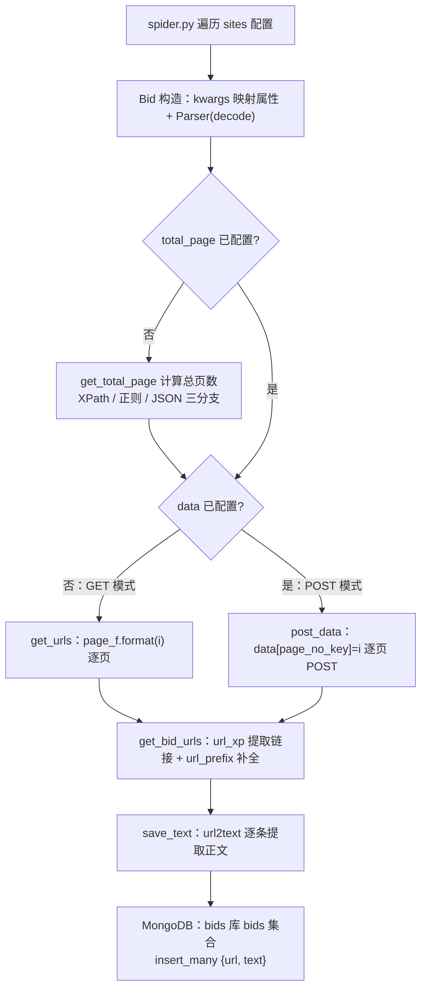
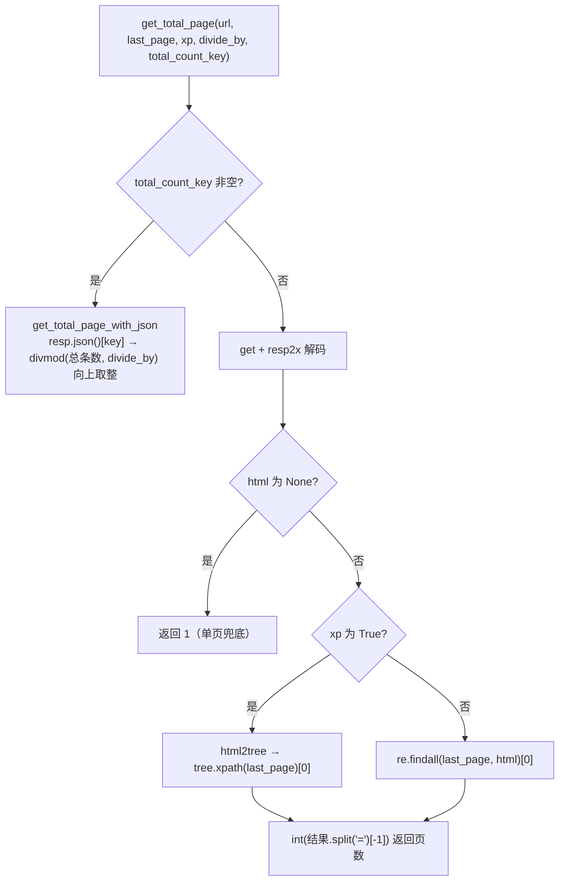

# bids-spider 实现细节-配置驱动抓取框架V1.0

| 文档版本 | 创建日期 | 修订简述 |
| ---- | ---- | ---- |
| V1.0 | 2026-09-17 | 初版 |

## 目录

- [1 子系统概述](#1-子系统概述)
- [2 核心机制详解](#2-核心机制详解)
  - [2.1 声明式站点配置模型](#21-声明式站点配置模型)
  - [2.2 抓取模式分派（GET / POST）](#22-抓取模式分派get--post)
  - [2.3 总页数三种计算方式](#23-总页数三种计算方式)
  - [2.4 相对链接补全](#24-相对链接补全)
  - [2.5 正文提取与 MongoDB 入库](#25-正文提取与-mongodb-入库)
  - [2.6 容错策略](#26-容错策略)
  - [2.7 JSON 链路缺口与未完成方法](#27-json-链路缺口与未完成方法)
- [3 关键流程](#3-关键流程)
- [4 设计决策与权衡](#4-设计决策与权衡)
- [5 关键配置项](#5-关键配置项)
- [6 与其他子系统的关系](#6-与其他子系统的关系)
- [7 源码定位](#7-源码定位)
- [8 参考资料](#8-参考资料)

## 1 子系统概述

本子系统是 bids-spider 项目的**配置驱动抓取框架**（旧版链路），核心思想：用一份站点配置字典声明式描述一个招标网站，由通用解析器完成「请求 → 解码 → 解析 → 入库」全部步骤，新增站点不需要编写爬虫代码。

链路角色与职责：

| 角色 | 载体 | 职责 |
| ---- | ---- | ---- |
| 配置声明 | `sites.py` 中的 `sites` 列表 | 以字典描述站点的抓取方式（入口 URL、分页模板、末页定位、链接 XPath、POST 表单等） |
| 入口编排 | `spider.py` | 遍历 `sites`，逐个实例化 `Bid` 并执行 |
| 站点逻辑 | `gov_parser.py` 的 `Bid` 类 | 读取配置项，按 GET / POST 两种模式分派抓取 |
| 通用解析器 | `utils.py` 的 `Parser` 类 | 请求、解码、HTML 转树、总页数计算、链接提取、正文提取、MongoDB 入库 |
| 数据存储 | MongoDB | `bids` 库 `bids` 集合，写入 `{url, text}` 结构 |

`spider.py` 是全部入口逻辑：

```python
from sites import sites
from gov_parser import Bid

for site in sites:
    b = Bid(**site)
    b.get_info()
```

当前 `sites.py` 中仅保留 1 条活跃配置（重庆 cqgp，指向 JSON API），其余 6 条均为被注释的历史配置（zycg、ccgp 搜索、北京市级、北京区级、天津两条），是理解配置模式演进的重要素材。

## 2 核心机制详解

### 2.1 声明式站点配置模型

`Bid.__init__(**kwargs)` 把配置字典的键值直接映射为实例属性，并实例化一个 `Parser`（解码方式取自配置的 `decode`）。配置项与消费方对应关系：

| 配置键 | 默认值 | 映射属性 | 消费位置 |
| ---- | ---- | ---- | ---- |
| `decode` | `'utf-8'` | `self.decode` | `Parser(decode=...)`，响应体解码 |
| `start_url` | 必填（无默认） | `self.start_url` | 总页数计算的请求地址；入口页 |
| `page_f` | 无 | `self.page_f` | GET 模式分页 URL 模板 |
| `last_page_xp` | 无 | `self.last_page_xp` | 总页数定位表达式（XPath 或正则） |
| `xp_page` | `True` | `self.xp_page` | 末页取值方式：XPath / 正则 |
| `url_xp` | 必填（无默认） | `self.url_xp` | 列表页链接提取 XPath |
| `url_prefix` | `''` | `self.url_prefix` | 相对链接补全前缀 |
| `total_page` | 无 | `self.total_page` | 固定总页数，存在时跳过计算 |
| `data` | 无 | `self.data` | POST 模式静态表单数据 |
| `page_no_key` | 无 | `self.page_no_key` | POST 表单中的页码字段名 |
| `post_url` | 无 | `self.post_url` | POST 模式请求地址 |
| `divide_by` | 无 | `self.divide_by` | JSON 总条数换算页数的每页条数 |
| `total_count_key` | 无 | `self.total_count_key` | JSON 响应中总条数字段名 |

其中 `start_url` 与 `url_xp` 无默认值，`kwargs['start_url']`、`kwargs['url_xp']` 直接取键，缺失即抛 `KeyError`，属必填项。

### 2.2 抓取模式分派（GET / POST）

`Bid.get_info()` 是分派入口：

```python
def get_info(self):
    if self.total_page is None:
        self.total_page = self.parser.get_total_page(self.start_url, self.last_page_xp, self.xp_page)
    if self.data is None:
        self.get_urls()      # GET 模式
    else:
        self.post_data()     # POST 模式
```

分派逻辑：

- **先算总页数**：`total_page` 未配置时，用 `Parser.get_total_page` 从 `start_url` 计算；已配置（如北京历史配置 `total_page: 1000`）则直接使用。
- **再分派抓取**：以 `data` 是否配置为判据——无 `data` 走 GET 模式 `get_urls()`；有 `data` 走 POST 模式 `post_data()`（天津历史配置即 POST 模式）。

**GET 模式**（`get_urls`）：

```python
pages = [self.page_f.format(i) for i in range(1, self.total_page)]
for page in pages:
    urls = self.parser.get_bid_urls(page, self.url_xp, self.url_prefix)
    self.parser.save_text(urls)
```

- 依赖 `page_f` 分页模板，页码经 `str.format` 填入 `{}` 占位；
- 遍历范围是 `range(1, self.total_page)`，即第 1 页至 `total_page - 1` 页，**末页不在遍历范围内**（区间开闭与 POST 模式不一致）。

**POST 模式**（`post_data`）：

```python
for i in range(1, self.total_page+1):
    self.data.update({self.page_no_key: i})
    urls = self.parser.get_bid_urls(self.post_url, self.url_xp, self.url_prefix, True, self.data)
    self.parser.save_text(urls)
```

- 遍历 `range(1, total_page+1)`，含末页；
- 每页把页码写入表单：`data[page_no_key] = i`（天津配置 `page_no_key: 'page'`）；
- 请求地址固定为 `post_url`，表单数据为 `data`（天津示例含 `method`、`id`、`step`、`view`、`st` 静态字段）；
- `Parser.post` 以 `requests.post(url, json=data)` 提交，即按 JSON 表单发送。

### 2.3 总页数三种计算方式

`Parser.get_total_page(url, last_page='', xp=True, divide_by=20, total_count_key='')` 提供三种计算分支：

```python
def get_total_page(self, url, last_page='', xp=True, divide_by=20, total_count_key=''):
    if total_count_key:
        return self.get_total_page_with_json(url, total_count_key, divide_by)
    resp = self.get(url)
    html = self.resp2x(resp)
    if html is None:
        return 1
    if xp is True:
        tree = self.html2tree(html)
        last_page = tree.xpath(last_page)[0]
    else:
        last_page = re.findall(last_page, html)[0]
    return int(last_page.split('=')[-1])
```

| 方式 | 触发条件 | 实现 | 对应历史配置 |
| ---- | ---- | ---- | ---- |
| XPath | `xp_page=True` | `html2tree` 后 `tree.xpath(last_page_xp)[0]` 取首个匹配节点文本 | zycg（`//ul[@class="lby-list"]//a[last()-1]/text()`）、天津（`//span[@class="countPage"]/b/text()`） |
| 正则 | `xp_page=False` | `re.findall(last_page_xp, html)[0]` 取首个匹配 | ccgp 搜索（`size: (\d.*?),`）、cqgp |
| JSON | 传入 `total_count_key` | 见下 `get_total_page_with_json` | cqgp 配置声明了 `total_count_key`，但经 `Bid` 链路未接线（见 2.7） |

三种方式的结果统一经 `int(last_page.split('=')[-1])` 转整数——即对取到的文本以 `=` 分割后取末段（推测：为兼容形如 `page=5`、`size: 123,` 这类带分隔符的文本格式；纯数字文本亦能正确转换）。解码结果为空时返回 `1` 兜底（单页处理）。

**JSON 分支**（`get_total_page_with_json`）：

```python
resp = self.get(url)
data = self.resp2x(resp, True)          # resp.json()
total_count = int(data.get(key))
d, m = divmod(total_count, divide_by)
if m == 0:
    return d
return d + 1
```

先取响应 JSON 中 `total_count_key` 字段的总条数，再按 `divide_by`（每页条数）向上取整得到页数（整除返回商，否则商 + 1）。

### 2.4 相对链接补全

`Parser.get_bid_urls` 对 `url_xp` 提取到的每个 href 做补全：

```python
for i in tree.xpath(url_xp):
    if prefix != '':
        i = i.split('/', 1)[-1]
    urls.append(prefix+i)
```

规则：

- `url_prefix` 为空（`''`）：href 原样收集，适用于绝对链接；
- `url_prefix` 非空：先执行 `href.split('/', 1)[-1]` 截掉首个 `/` 之前的全部内容与首个 `/` 本身，再拼接前缀。例如 zycg 配置 `url_prefix='http://www.zycg.gov.cn/'`、href 为 `/article/show/123` 时，结果为 `http://www.zycg.gov.cn/article/show/123`（推测：该截取逻辑假设 href 以 `/` 开头，用于去掉域名前的协议头等冗余片段；若 href 不以 `/` 开头，`split('/', 1)[-1]` 会返回原串）。

### 2.5 正文提取与 MongoDB 入库

- **连接**：`connect_col()` 执行 `MongoClient()[DB].bids`，其中 `DB = 'bids'`，即写入 `bids` 库的 `bids` 集合。
- **正文提取**：`url2text(url)` 用 `requests.get` 拉取详情页 → `resp2x` 按实例 `decode` 解码 → `html2text.HTML2Text`（`ignore_links=True`、`ignore_images=True`）转为纯文本。
- **入库**：`save_text(urls)` 构造 `[{'url': url, 'text': self.url2text(url)} for url in urls]`，以 `insert_many` 批量写入。

存储结构为 `{url, text}` 键值对，无去重字段与字段级结构，重复抓取会积累重复记录。

### 2.6 容错策略

框架整体采用「异常返回空值」的宽进宽出策略，所有网络/解析异常均被裸 `except` 吞掉：

| 方法 | 失败返回值 | 说明 |
| ---- | ---- | ---- |
| `get` / `post` | `None` | 请求异常时返回 `None` |
| `html2tree` | `None` | HTML 转树失败返回 `None` |
| `resp2x` | `''` | 解码/JSON 解析失败返回空串 |
| `get_total_page` | `1` | `html` 为 `None` 时按单页兜底 |
| `get_bid_urls` | `None` | `tree` 为 `None` 时直接返回 `None` |

细节要点：

- 随机 UA：`get`/`post` 仅在调用方显式传入 `headers` 时，才注入 `UA.random`（`fake_useragent`）；未传 `headers` 则请求不带自定义 UA；
- 超时：`REQUEST_TIMEOUT = 5` 秒，全局固定；
- 容错缺口：`get_bid_urls` 在 `tree` 为 `None` 时返回 `None`，而 `save_text` 对 `urls` 直接 `for` 迭代，传入 `None` 会抛 `TypeError`——即列表页请求失败时，链路并不会被空值兜底，而是中断报错；
- 错误静默：裸 `except` 不记录任何日志，失败原因难以排查（见第 4 章权衡）。

### 2.7 JSON 链路缺口与未完成方法

**未完成方法 `get_bid_urls_with_json`**：

```python
def get_bid_urls_with_json(self, page, url_f, keys):
    resp = self.get(page)
    data = self.resp2x(resp, True)
    # TODO:怎样让程序知道数据结构有几级
```

该方法仅完成「请求 + 转 JSON」，随后即到 TODO 注释——「怎样让程序知道数据结构有几级」，即 JSON 中链接列表的嵌套层级不可预知，通用遍历未实现，方法无返回结果。

**接线缺口（重要发现）**：

- `Bid.get_info()` 调用 `get_total_page(self.start_url, self.last_page_xp, self.xp_page)` 时**未透传** `divide_by` 与 `total_count_key`，因此 JSON 总页数分支经 `Bid` 链路不可达，仅在直接调用 `Parser.get_total_page` 时生效；
- `Bid.get_urls()` 调用 `get_bid_urls(page, self.url_xp, self.url_prefix)` 时**未传** `url_f`/`keys`，故 `get_bid_urls_with_json` 经 `Bid` 链路同样不可达（`get_bid_urls` 仅在 `url_f` 非空时才路由到该未完成方法）；
- 活跃配置 cqgp 的 `start_url`/`page_f` 为 JSON API（`.../notices/stable?pi=1&ps=50`），但其 `last_page_xp='size: (\d.*?),'` 为正则模式、`xp_page=False`，按当前 `Bid` 链路会对 JSON 响应文本执行该正则；若响应不含 `size: (\d.*?),` 模式，`re.findall(...)[0]` 将抛出 `IndexError`。其 `url_xp` 亦为 HTML 结构 XPath（`//ul[@class="vT-srch-result-list-bid"]/li/a/@href`），与 JSON 响应不匹配（推测：cqgp 配置与 `get_bid_urls_with_json`/`total_count_key` 配套设计，属于面向 JSON 接口的接入尝试，因通用 JSON 解析未完成而处于半接线状态，实际运行依赖后续修复或手工直调 `Parser`）。

## 3 关键流程

整体链路：



总页数计算分支：



## 4 设计决策与权衡

| 决策 | 取舍 | 代价 |
| ---- | ---- | ---- |
| 配置驱动替代硬编码 | 新增站点只需在 `sites.py` 加一条字典，无需写代码；`spider.py` 自动遍历执行 | 站点结构改版需维护配置；JS 渲染、复杂反爬、动态交互等场景配置无法表达，需另走 Selenium/新版框架 |
| 通用解析器收敛公共能力 | `Parser` 把请求/解码/转树/提取/入库统一封装，全站共用 | 站点差异只能靠配置项参数化，难以表达特殊逻辑 |
| 总页数三分支（XPath / 正则 / JSON） | 兼容静态列表页、搜索页（页内文本取末页）、JSON 接口（总条数换算）三类站点 | 三分支语义不统一，XPath/正则结果还叠加 `split('=')` 处理，可读性差 |
| 裸 `except` 返回空值 | 单页失败不中断整体抓取 | 错误被静默吞掉、无日志；且 `save_text(None)` 处兜底不闭环，仍会 `TypeError` 中断 |
| `{url, text}` KV 入库 | 结构极简，`insert_many` 一步落库 | 无去重字段、无字段级结构，重复抓取积累重复记录，检索能力弱（后被 ES + `Tender` 模型取代） |
| 随机 UA 按需注入 | 仅在调用方传 `headers` 时注入 `UA.random`，保持封装简单 | 未传 `headers` 的请求裸奔无 UA，反爬绕过能力不稳定 |

历史配置注释（`sites.py` 中被注释的 6 条）体现了配置模式的演进脉络：

- **zycg（中央政府采购网）**：GET 模式 + XPath 末页，配置驱动的最初形态；
- **ccgp 搜索（中国政府采购网）**：GET 模式 + 正则末页（`size: (\d.*?),`），把末页定位从 XPath 扩展到正则，覆盖搜索类页面；
- **北京（市级/区级两条）**：GET 模式 + 固定 `total_page: 1000`，`decode: 'gbk'`，说明配置需适配不同站点编码与分页结构；
- **天津（两条）**：POST 模式，引入 `post_url` + `data` + `page_no_key`，把配置驱动从「静态分页 URL」扩展到「表单提交」；
- **重庆（cqgp，唯一活跃）**：指向 JSON API，声明 `divide_by`/`total_count_key`，尝试面向接口的总页数计算——但 JSON 解析链路未完成（见 2.7）。

## 5 关键配置项

| 配置项 | 类型 | 默认值 | 含义 |
| ---- | ---- | ---- | ---- |
| `decode` | `str` | `'utf-8'` | 响应体解码编码，`resp2x` 以 `resp.content.decode(decode)` 使用 |
| `start_url` | `str` | 必填 | 入口地址；未配置 `total_page` 时也作为总页数计算的请求地址 |
| `page_f` | `str` | 无 | GET 模式分页 URL 模板，含 `{}` 页码占位，`page_f.format(i)` 生成各页 |
| `last_page_xp` | `str` | 无 | 末页定位：`xp_page=True` 时为 XPath 表达式，否则为正则模式 |
| `xp_page` | `bool` | `True` | 末页取值方式：`True` 走 XPath，`False` 走正则 |
| `url_xp` | `str` | 必填 | 列表页中提取招标链接的 XPath（如 `//ul[@class="..."]/li/a/@href`） |
| `url_prefix` | `str` | `''` | 相对链接补全前缀；非空时对 href 先截取首个 `/` 之后片段再拼接 |
| `total_page` | `int` | 无 | 固定总页数；配置后跳过 `get_total_page` 计算 |
| `post_url` | `str` | 无 | POST 模式请求地址（与 `data` 同时存在时走 POST 链路） |
| `data` | `dict` | 无 | POST 模式静态表单数据；非空即触发 POST 模式（天津示例含 `method`/`id`/`step`/`view`/`st`） |
| `page_no_key` | `str` | 无 | POST 表单中页码字段名，每页执行 `data[page_no_key] = i` |
| `divide_by` | `int` | 无 | JSON 总条数换算页数时的每页条数（`get_total_page_with_json` 使用；`get_total_page` 参数默认 `20`，但 `Bid` 未透传） |
| `total_count_key` | `str` | 无 | JSON 响应中总条数字段名（经 `Bid` 链路未接线，见 2.7） |

## 6 与其他子系统的关系

**与旧版存储 MongoDB**：本框架是 MongoDB 旧版存储的唯一写入方——`utils.py` 的 `connect_col()` 连接 `bids` 库 `bids` 集合，`Parser.save_text` 把 `{url, text}` 批量 `insert_many` 入库（对应 PRD 4.3.2「MongoDB 旧版存储」）。

**与新版 `crawler/` 的关系**：

- 新版以 `crawler/base_crawler.py` 的 `Tender` dataclass 与 `BaseCrawler` 基类为核心，使用 Playwright + stealth 真实浏览器，按省份独立编写爬虫类（`beijing.py`、`hebei.py`、`liaoning.py`、`tianjin.py`），数据落 ES（`utils/es.py`）并导出 Excel；
- 两者是**演进取代**关系：站点差异的表达方式从「改配置字典」变为「写省份爬虫类」；存储从 MongoDB 迁至 ES；抓取手段从 requests 升级为 Playwright 浏览器自动化。旧版配置驱动链路保留在 `sites.py`/`gov_parser.py`/`utils.py` 中，新版代码不再消费 `sites` 配置（对应 PRD 4.2「Playwright 抓取引擎（新版核心）」）。
- 根目录 `utils.py`（旧版解析器）与 `utils/` 包（新版 `es.py`/`log.py`/`captcha.py`）并存，`utils/__init__.py` 仅含注释 `# Utils package`。

**与 PRD 模块对应**：本文档对应 PRD 4.1「站点接入与配置化框架」——4.1.1「站点配置驱动」对应 `sites.py` + `spider.py` + `Bid` 的配置分派，4.1.2「通用解析器」对应 `utils.Parser` 的请求、解码、转树、总页数计算、链接提取、正文提取、入库能力；PRD 4.1.2 补充说明中亦记载了 `get_bid_urls_with_json` 未完成（含 TODO）与 JSON 通用解析未实现，与本文 2.7 一致。

## 7 源码定位

| 关键文件 / 类 / 函数 | 路径 | 说明 |
| ---- | ---- | ---- |
| `sites` 配置列表 | `sites.py` | 站点配置字典；1 条活跃（cqgp）+ 6 条被注释历史配置（zycg / ccgp 搜索 / 北京 x2 / 天津 x2） |
| 入口遍历 | `spider.py` | `Bid(**site).get_info()` 逐配置执行 |
| `Bid` 类 | `gov_parser.py` | 配置映射；`get_info` 分派、`get_urls`（GET 模式）、`post_data`（POST 模式） |
| `Bid.get_info` | `gov_parser.py` | 总页数计算 + 模式分派入口 |
| `Bid.get_urls` / `Bid.post_data` | `gov_parser.py` | GET / POST 两种逐页抓取实现 |
| `Parser` 类 | `utils.py` | 通用解析器：请求、解码、转树、提取、入库 |
| `Parser.get` / `Parser.post` | `utils.py` | requests 封装，5 秒超时，随机 UA（仅传 `headers` 时注入） |
| `Parser.html2tree` / `Parser.resp2x` | `utils.py` | HTML 转 lxml 树 / 按配置编码解码（支持 JSON） |
| `Parser.url2tree` / `Parser.url2text` | `utils.py` | 请求到树 / 请求到纯文本（html2text，忽略链接与图片） |
| `Parser.get_total_page` / `Parser.get_total_page_with_json` | `utils.py` | 总页数三种计算方式（XPath / 正则 / JSON） |
| `Parser.get_bid_urls` / `Parser.get_bid_urls_with_json` | `utils.py` | 链接提取；后者未完成（TODO，无返回值） |
| `Parser.save_text` | `utils.py` | 正文提取并 `insert_many` 写入 MongoDB |
| `connect_col` | `utils.py` | 连接 `bids` 库 `bids` 集合 |
| `load_urls` / `make_csv_handler` | `utils.py` | CSV 去重加载（返回 `set`）/ 追加写 CSV 句柄（旧筛选链路工具） |
| `make_driver` / `random_sleep` | `utils.py` | PhantomJS / Chrome headless 驱动创建（Selenium）/ 随机延时 |
| `filter_tender`（被注释） | `utils.py` | 旧版多关键词筛选招标写入 CSV 的逻辑，已停用 |
| `utils/__init__.py` | `utils/__init__.py` | 包标记文件，仅注释 |
| `crawler/base_crawler.py` | `crawler/base_crawler.py` | 新版基类（`Tender` + `BaseCrawler`，Playwright/ES/Excel），与旧版为取代关系 |

## 8 参考资料

- 源码：`sites.py`、`spider.py`、`gov_parser.py`、`utils.py`、`utils/__init__.py`（`/Users/xingan/Documents/software/aiengine/bids-spider/`）
- 新版参考实现：`crawler/base_crawler.py`、`crawler/beijing.py`、`crawler/hebei.py`、`crawler/liaoning.py`、`crawler/tianjin.py`、`utils/es.py`
- 产品需求文档：`docs/outcome/bids-spider产品需求文档V1.0.md`（章节 4.1「站点接入与配置化框架」、4.2「Playwright 抓取引擎」、4.3「数据存储与去重」）
