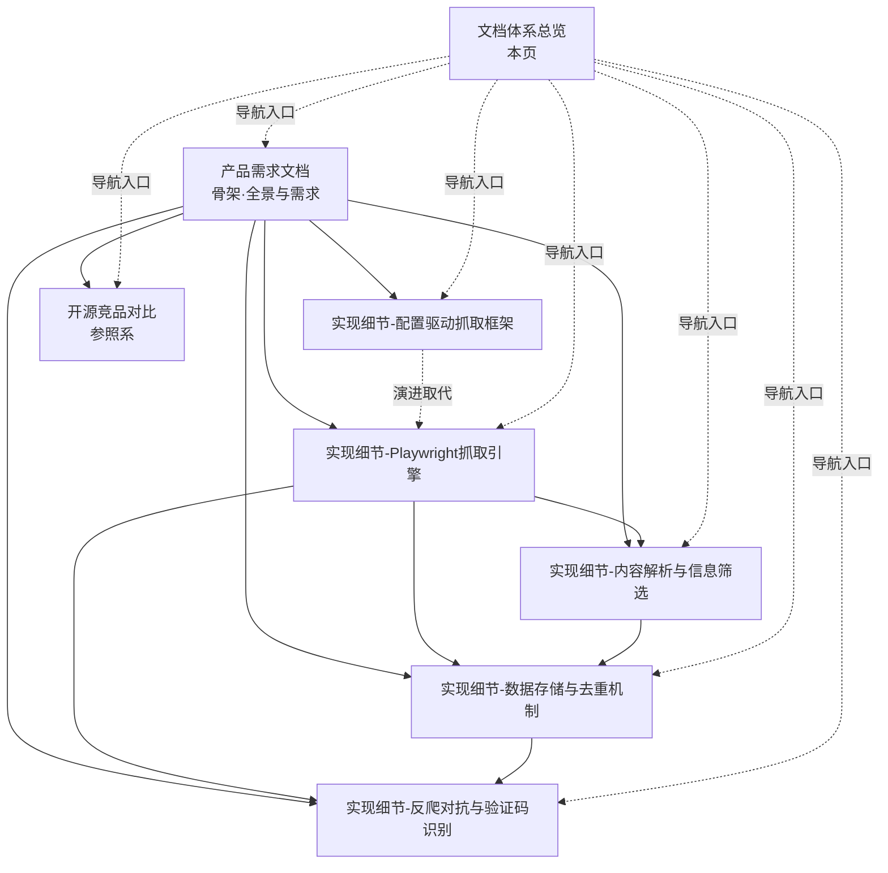

# bids-spider文档体系总览V1.0

| 文档版本 | 创建日期 | 修订简述 |
| ---- | ---- | ---- |
| V1.0 | 2026-09-17 | 初版：为 bids-spider 拆解文档体系（PRD + 5 份实现细节 + 竞品对比）建立总览索引页 |

## 目录

- [1 文档体系概览](#1-文档体系概览)
- [2 推荐阅读路径](#2-推荐阅读路径)
- [3 文档核心内容](#3-文档核心内容)
- [4 文档间关系](#4-文档间关系)
- [5 使用与维护说明](#5-使用与维护说明)

## 1 文档体系概览

### 1.1 体系说明

bids-spider（招标公告爬虫）拆解文档体系按三层组织：

| 层 | 角色 | 文档 |
| ---- | ---- | ---- |
| 骨架 | 产品需求（PRD），回答"项目是什么、解决什么问题" | 产品需求文档 |
| 血肉 | 实现细节（5 份），按核心子系统回答"怎么实现" | 配置驱动框架 / Playwright 引擎 / 存储与去重 / 反爬与验证码 / 解析与筛选 |
| 参照系 | 开源竞品对比，回答"与谁竞争、差异在哪" | 开源竞品对比 |

### 1.2 目录结构

```
bids-spider/
└── docs/
    └── outcome/
        ├── bids-spider产品需求文档V1.0.md
        ├── bids-spider实现细节-配置驱动抓取框架V1.0.md
        ├── bids-spider实现细节-Playwright抓取引擎V1.0.md
        ├── bids-spider实现细节-数据存储与去重机制V1.0.md
        ├── bids-spider实现细节-反爬对抗与验证码识别V1.0.md
        ├── bids-spider实现细节-内容解析与信息筛选V1.0.md
        ├── bids-spider开源竞品对比V1.0.md
        └── bids-spider文档体系总览V1.0.md（本页）
```

### 1.3 文档清单

| 文档名 | 类型 | 定位 | 相对链接 |
| ---- | ---- | ---- | ---- |
| bids-spider产品需求文档V1.0.md | PRD（产品理解型） | 项目全景：背景、范围、产品说明、市场分析、功能与非功能需求 | [查看](bids-spider产品需求文档V1.0.md) |
| bids-spider实现细节-配置驱动抓取框架V1.0.md | 实现细节 | 旧版 requests 链路：站点配置字典 + 通用解析器 | [查看](bids-spider实现细节-配置驱动抓取框架V1.0.md) |
| bids-spider实现细节-Playwright抓取引擎V1.0.md | 实现细节 | 新版核心：BaseCrawler 骨架、Tender 模型、各省爬虫 | [查看](bids-spider实现细节-Playwright抓取引擎V1.0.md) |
| bids-spider实现细节-数据存储与去重机制V1.0.md | 实现细节 | ES/MongoDB 存储、href 幂等去重、Excel 导出 | [查看](bids-spider实现细节-数据存储与去重机制V1.0.md) |
| bids-spider实现细节-反爬对抗与验证码识别V1.0.md | 实现细节 | Stealth 浏览器、随机延时、请求头拦截、OCR | [查看](bids-spider实现细节-反爬对抗与验证码识别V1.0.md) |
| bids-spider实现细节-内容解析与信息筛选V1.0.md | 实现细节 | 列表/详情解析、JSON 接口解析、关键词过滤 | [查看](bids-spider实现细节-内容解析与信息筛选V1.0.md) |
| bids-spider开源竞品对比V1.0.md | 竞品调研 | 开源采集项目、商业平台、框架层对比 | [查看](bids-spider开源竞品对比V1.0.md) |

## 2 推荐阅读路径

| 角色 / 目的 | 推荐顺序 |
| ---- | ---- |
| 快速了解项目是什么（10 分钟） | PRD 第 1-2 章（概述 + 产品说明） |
| 全面理解产品需求 | 产品需求文档 V1.0（6 章通读） |
| 深挖实现原理（技术读者） | Playwright 抓取引擎 → 数据存储与去重 → 内容解析与信息筛选 → 反爬对抗与验证码 → 配置驱动框架 |
| 理解旧版演进脉络 | 配置驱动抓取框架（含 sites.py 历史配置注释分析） |
| 竞品选型 / 决策参考 | 开源竞品对比 V1.0 → PRD 第 3 章（市场与竞品分析） |
| 汇报 / 总览 | 本总览页 + PRD 产品说明 |

## 3 文档核心内容

### 3.1 产品需求文档

- **摘要**：bids-spider 是面向政府招标监控的开源爬虫，将分散在全国各省政府采购网的招标公告自动化采集、结构化入库并导出 Excel。文档覆盖两代架构（旧版配置驱动 requests 链路、新版 Playwright 真实浏览器链路）、五个功能模块（站点接入与配置化框架、Playwright 抓取引擎、数据存储与去重、反爬规避与验证码识别、内容解析与信息筛选）及按实际取舍的非功能需求。
- [bids-spider产品需求文档V1.0.md](bids-spider产品需求文档V1.0.md)

### 3.2 实现细节（5 份，按子系统归并）

- **配置驱动抓取框架**：声明式站点配置（start_url/page_f/last_page_xp/url_xp 等 13 项）+ 通用 Parser（GET/POST 双模式、总页数三种计算、相对链接补全、MongoDB 入库）。指出 JSON 链路接线缺口（get_bid_urls_with_json 未完成、参数未透传）。
- **Playwright 抓取引擎**：Tender 六字段模型、BaseCrawler.run 骨架（增量/历史双模式、Stealth 启动、finally 落库导出）、四省爬虫差异化实现（北京定位器、河北页面 JS 抽取、辽宁/天津请求头拦截 + JSON 接口直连）、href 幂等去重。
- **数据存储与去重机制**：ES tenders 索引 mapping（六字段、dynamic:false）、href 作文档 _id 实现幂等、bulk 批量写入（chunk 500）、get_exists_url_from_es 增量查询；旧版 MongoDB {url,text} 无去重；pandas 导出 Excel。
- **反爬对抗与验证码识别**：四层策略——浏览器层（Stealth + 有头模式）、行为层（随机延时 1-60s）、请求认证层（拦截 authorization/fn 头、localStorage 降级）、验证码层（百度 OCR + 图片预处理、云码平台）；标注 OCR 模块当前未被爬虫引用。
- **内容解析与信息筛选**：各省定位器/正文容器差异（.mainTextBox / div.ewb-copy / noticeContent）、相对链接补全两种方式、JSON 接口成功判断（code 200 / statusCode 2000）、ccgp.py 关键词组合过滤与三 CSV 分工、高校招聘定制抓取。
- [配置驱动抓取框架](bids-spider实现细节-配置驱动抓取框架V1.0.md) / [Playwright 抓取引擎](bids-spider实现细节-Playwright抓取引擎V1.0.md) / [数据存储与去重机制](bids-spider实现细节-数据存储与去重机制V1.0.md) / [反爬对抗与验证码识别](bids-spider实现细节-反爬对抗与验证码识别V1.0.md) / [内容解析与信息筛选](bids-spider实现细节-内容解析与信息筛选V1.0.md)

### 3.3 开源竞品对比

- **摘要**：按三层对比——直接竞品（bid-collection 等开源采集项目）、应用平台（千里马、剑鱼、乙方宝、中国政府采购网）、框架层（Scrapy/DrissionPage/Playwright）。结论：本项目优势在开源免费、数据自主、增量幂等去重、结构清晰；短板在无生产化能力、无业务交付层、站点适配脆弱、凭据硬编码。
- [bids-spider开源竞品对比V1.0.md](bids-spider开源竞品对比V1.0.md)

## 4 文档间关系



各文档角色一句话说明：

- **产品需求文档**：骨架，统领全局，定义产品定位、功能边界与需求；实现细节各主题与之对应（PRD 第 4 章功能模块 = 实现细节 5 份主题）。
- **5 份实现细节**：血肉，分别展开一个子系统的机制、流程、配置与源码定位；其中"配置驱动抓取框架"对应旧版链路，被"Playwright 抓取引擎"演进取代，两者为演进关系而非并存平级。
- **开源竞品对比**：参照系，回答市场定位与差异化，与 PRD 第 3 章市场与竞品分析呼应。
- **本总览页**：导航入口，汇总各文档摘要与关系。

## 5 使用与维护说明

- **版本一致性**：全部文档以最新源码为准（拆解时点 2026-09-17）；源码改版后应更新对应实现细节文档，并同步本页摘要与 PRD 功能需求。
- **数据时效**：PRD 与竞品对比中的市场数据（千里马、剑鱼等）以官网实时数据为准，仅作量级参考。
- **新增文档登记约定**：此后新增或修改文档，须同步更新本索引页——第 1.3 节文档清单表（新增行）、第 3 节核心内容（新增摘要 + 相对链接）、第 4 节关系图（如需）。
- **相对链接说明**：本页链接使用文档同名相对路径，`docs/outcome/` 扁平存放，编辑器 / 浏览器可直接跳转。
